class: middle, center, title-slide

$$
\gdef\x{\bm{x}}
\gdef\s{\bm{s}}
\gdef\w{\bm{w}}
\gdef\RR{\mathbb{R}}
\gdef\EE{\mathbb{E}}
\gdef\PP{\mathbb{P}}
\gdef\cS{\mathcal{S}}
\gdef\cW{\mathcal{W}}
$$

# Differentiable programming

Lecture 2: Differentiable programs

  
Mathieu Blondel, Vincent Roulet

---

# Outline

- Pararameterized programs
  * Computation chains
  * Feedforward networks
  * Multilayer perceptrons
  * Directed acyclic graphs (DAGs)
  * Computation graphs
- Control flows
  * Step functions
  * Comparison operators

---

## Computation chains

.center.width-100[]

Sequence of functions
$$
\begin{aligned}
\s\_0 &\in \cS\_0\nonumber \\\\
\s\_1 &\coloneqq f\_1(\s\_0) \in \cS\_1 \\\\
     & \hspace{6pt} \vdots\\\\
\s\_K &\coloneqq f\_K(\s\_{K-1}) \in \cS\_K \\\\
f(\s\_0) &\coloneqq \s\_K
\end{aligned}
$$

Equivalent to function compositions
$$
\begin{aligned}
f(\s\_0)
&= (f\_K \circ \dots \circ f\_2 \circ f\_1)(\s\_0) \\\\
&= f\_K(\dots f\_2(f\_1(\s\_0)))
\end{aligned}
$$

---

## Feedforward networks = parameterized computain chains

.center.width-100[]

$$
\begin{aligned}
\s\_0 &\coloneqq \x \\\\
\s\_1 &\coloneqq f\_1(\s\_0, \w\_1) \\\\
\s\_2 &\coloneqq f\_2(\s\_1, \w\_2) \\\\
&\vdots \\\\
\s\_K &\coloneqq f\_K(\s_{K-1}, \w\_K) \\\\
f(\x, \w) &\coloneqq \s\_K
\end{aligned}
$$

$$
\w \coloneqq (\w\_1, \dots, \w\_K) \in (\cW\_1, \dots, \cW\_K)
$$

---

## Multilayer perceptrons

 

$$
\begin{aligned}
\s\_0 &\coloneqq \x \\\\
\s\_1 &\coloneqq f\_1(\s\_0, \w\_1) \coloneqq a\_1(\bm{W}\_1 \s\_0 + \bm{b}\_1) \\\\
\s\_2 &\coloneqq f\_2(\s\_1, \w\_2) \coloneqq a\_2(\bm{W}\_2 \s\_1 + \bm{b}\_2) \\\\
&\vdots \\\\
\s\_K &\coloneqq f\_K(\s\_{K-1}, \w\_K) \coloneqq a\_K(\bm{W}\_K \s\_{K-1} + \bm{b}\_K)
\end{aligned}
$$
 
where 
* $\w\_k \coloneqq (\bm{W}\_k, \bm{b}\_k)$ are the parameters of layer $k$
* $a_k$ is an activation function (softplus, ReLu, ...)

 

We can see an MLP as a generalized linear model (GLM)  
$\s\_{K-1} \mapsto a\_K(\bm{W}\_K \s\_{K-1} + \bm{b}\_K)$
on top of a learned representation $\s_{K-1}$.

---

## Directed acyclic graphs (DAGs)

.center.width-50[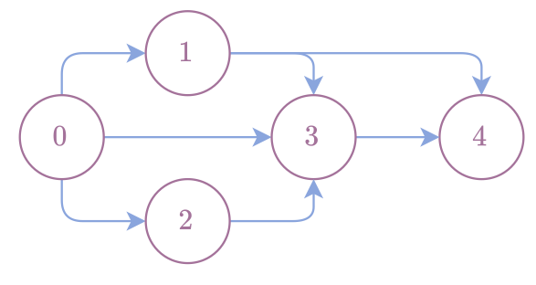]

Nodes can have parent or children nodes.

DAGs define a topological order.

Examples: 
* (0,1,2,3,4)
* (0,2,1,3,4)

---

## Representing programs as DAGs

 

.center.width-100[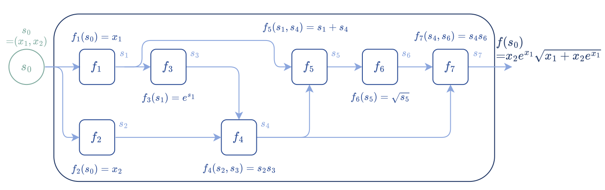]

Representation of $f(x_1, x_2) \coloneqq x_2e^{x_1}\sqrt{x_1 + x_2 e^{x_1}}$ as a DAG

 

Functions and variables are nodes.

Edges indicate function and variable dependencies.

The function $f$ is decomposed as $8$ elementary functions in topological order.

---

## Executing a program

 

.center.width-100[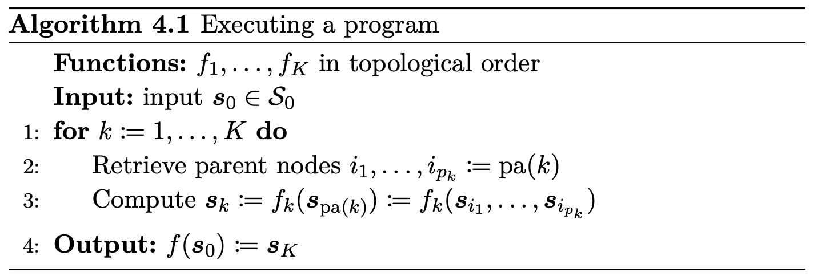]

---

## Representation used in the book

.center.width-70[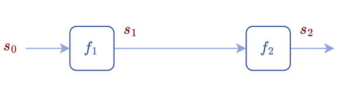]

Functions and output variables are represented by the same nodes.

 

## Alternative representation

.center.width-70[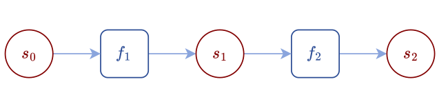]

Functions and variables are represented by a disjoint set of nodes (bipartite graph).

---

## Heaviside step function

$$
\mathrm{step}(u)
\coloneqq \begin{cases}
    1 &\text{ if } ~ u \ge 0 \\\\
    0 &\text{ otherwise } 
\end{cases}
$$
It is a function from $\RR$ to $\\{0,1\\}$.

 

.center.width-70[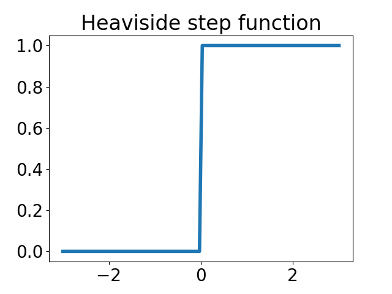]

---

## Inequality operators

Greater than
$$
\mathrm{gt}(u\_1, u\_2)
\coloneqq
\begin{cases}
1 &\text{ if } u\_1 \ge u\_2 \\\\
0 &\text{ otherwise }
\end{cases}
= \mathrm{step}(u\_1 - u\_2)
$$

Less than
$$
\mathrm{lt}(u\_1, u\_2)
\coloneqq
\begin{cases}
1 &\text{ if } u\_1 \le u\_2 \\\\
0 &\text{ otherwise }
\end{cases}
= \mathrm{step}(u\_2 - u\_1)
$$

.center.width-40[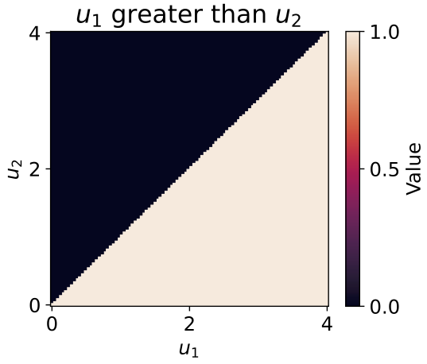]

---

## Equality operators

Equal
$$
\mathrm{eq}(u\_1, u\_2)
\coloneqq
\begin{cases}
1 &\text{ if } |u\_1 - u\_2| = 0 \\\\
0 &\text{ otherwise }
\end{cases}
= \mathrm{step}(u\_2 - u\_1) \cdot \mathrm{step}(u\_1 - u\_2) \\
$$

Not equal
$$
\mathrm{neq}(u\_1, u\_2)
\coloneqq
\begin{cases}
1 &\text{ if } |u\_1 - u\_2| > 0 \\\\
0 &\text{ otherwise }
\end{cases}
= 1 - \mathrm{step}(u\_2 - u\_2) \cdot \mathrm{step}(u\_1 - u\_2)
$$

.center.width-40[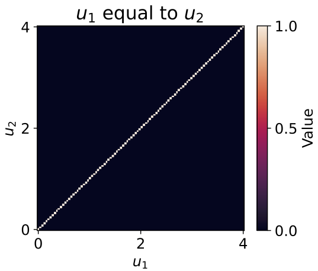]

---

## Sigmoid functions

An "S"-shaped function for squashing $\RR$ to $[0,1]$

Desired properties

* $\mathrm{sigmoid}\_\sigma(-u) = 1 - \mathrm{sigmoid}\_\sigma(u)$
* $\lim\_{u \to \infty} \mathrm{sigmoid}\_\sigma(u) = 1$
* $\lim\_{u \to -\infty} \mathrm{sigmoid}\_\sigma(u) = 0$
* $\mathrm{sigmoid}\_\sigma(0) = \frac{1}{2}$

 

.center.width-50[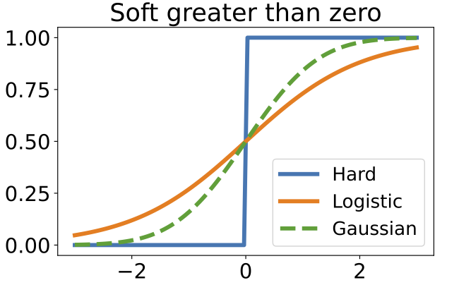]

---

## Soft greater than

We can use the **CDF** of a <em>standard</em> logistic or Gaussian distribution:

* Logistic: $\mathrm{sigmoid}_\sigma(u) \coloneqq \frac{1}{1+ e^{-u/\sigma}}$

* Gaussian: $\mathrm{sigmoid}_\sigma(u) \coloneqq \Phi(u/\sigma)
= \frac{1}{2}\left[
    1 + \mathrm{erf}\left(\frac{z}{\sqrt{2}}\right)
\right]$

 

.center.width-50[]

---

## Hard versus soft greater than

$\mathrm{gt}(u\_1, u\_2) = \mathrm{step}(u\_1 - u\_2)$
.center.width-40[]

$\mathrm{gt}\_\sigma(u\_1, u\_2) \coloneqq \mathrm{sigmoid}\_\sigma(u\_1 - u\_2)$
.center.width-40[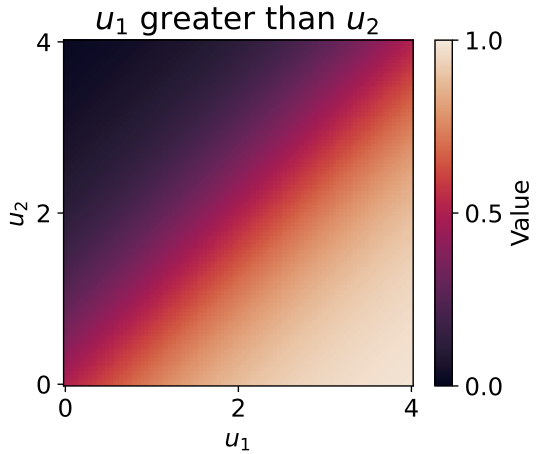]

---

## Stochastic perspective (1/2)

Suppose 
$U\_1 \sim p\_{\mu\_1,\sigma\_1}$
and
$U\_2 \sim p\_{\mu\_2,\sigma\_2}$

$$
\begin{aligned}
\mathrm{gt}\_\sigma(\mu\_1, \mu\_2) 
&= \EE\left\[\mathrm{gt}(U\_1, U\_2)\right\] \\\\
&= \EE\left\[\mathrm{step}(U\_1 - U\_2)\right\] \\\\
&= \PP(U\_1 - U\_2 \ge 0) \\\\
&= \PP(U\_2 - U\_1 \le 0) \\\\
&= F_{U\_2 - U\_1}(0)
\end{aligned}
$$

.center.width-50[]

---

## Stochastic perspective (2/2)

 

If $U\_1 \sim \mathrm{Normal}(\mu\_1, \sigma\_1^2)$
and
$U\_2 \sim \mathrm{Normal}(\mu\_2, \sigma\_2^2)$,
$$
U\_1 - U\_2 \sim \mathrm{Normal}(\mu\_1 - \mu\_2, \sigma\_1^2 + \sigma\_2^2)
$$
$\Rightarrow \mathrm{gt}\_\sigma(\mu\_1, \mu\_2) 
= \Phi\left(\frac{\mu\_1-\mu\_2}{\sigma}\right)$
  

--- 

If 
$U\_1 \sim \mathrm{Gumbel}(\mu\_1, \sigma)$
and
$U\_2 \sim \mathrm{Gumbel}(\mu\_2, \sigma)$,
$$
U\_1 - U\_2 \sim \mathrm{Logistic}(\mu\_1 - \mu\_2, \sigma)
$$
$\Rightarrow \mathrm{gt}\_\sigma(\mu\_1, \mu\_2) 
= \mathrm{logistic}\left(\frac{\mu\_1-\mu\_2}{\sigma}\right)$

---

## Soft equality operators

We can use a normalized kernel
$\kappa\_\sigma$ (logistic, Gaussian) centered on zero.
 
$$
\mathrm{eq}\_\sigma(\mu\_1,\mu\_2) 
\coloneqq
\frac{\kappa\_\sigma(\mu\_1 - \mu\_2)}{\kappa\_\sigma(0)}
$$

 

.center.width-50[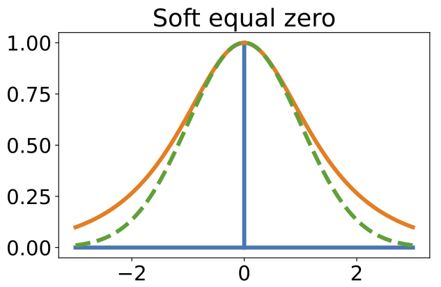]

---

## Stochastic perspective

The kernel corresponds to using the distribution **PDF**

$$
\mathrm{eq}\_\sigma(\mu\_1,\mu\_2) 
= \frac{f\_{U\_1 - U\_2}(0)}{f\_{0}(0)}
$$
where
$$
\begin{aligned}
f\_{U\_1-U\_2}(0)
&= (f\_{U\_1} \ast f\_{-U\_2})(0) \\\\
&= \int\_{-\infty}^\infty f\_{U\_1}(\tau) f\_{-U\_2}(-\tau) d\tau \\\\
&= \int\_{-\infty}^\infty f\_{U\_1}(\tau) f\_{U\_2}(\tau) d\tau \\\\
&\coloneqq \langle f\_{U\_1}, f\_{U\_2} \rangle \\\\
&\coloneqq \kappa(\mu\_1,\mu\_2)
\end{aligned}
$$
(the PDF of the sum of two random variables = **convolution** of the PDFs)
