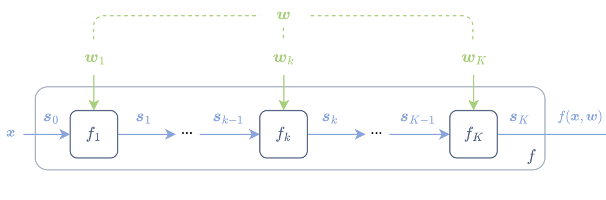

class: middle, center, title-slide

$$
\gdef\x{\bm{x}}
\gdef\s{\bm{s}}
\gdef\w{\bm{w}}
\gdef\RR{\mathbb{R}}
\gdef\cS{\mathcal{S}}
\gdef\cW{\mathcal{W}}
$$

# Differentiable programming

Lecture 2: Differentiable programs

  
Mathieu Blondel, Vincent Roulet

---

# Outline

- Pararameterized programs
  * Computation chains
  * Feedforward networks
  * Multilayer perceptrons
  * Directed acyclic graphs (DAGs)
  * Computation graphs
- Control flows

---

## Computation chains

.center.width-100[]

Sequence of functions
$$
\begin{aligned}
\s\_0 &\in \cS\_0\nonumber \\\\
\s\_1 &\coloneqq f\_1(\s\_0) \in \cS\_1 \\\\
     & \hspace{6pt} \vdots\\\\
\s\_K &\coloneqq f\_K(\s\_{K-1}) \in \cS\_K \\\\
f(\s\_0) &\coloneqq \s\_K
\end{aligned}
$$

Equivalent to function compositions
$$
\begin{aligned}
f(\s\_0)
&= (f\_K \circ \dots \circ f\_2 \circ f\_1)(\s\_0) \\\\
&= f\_K(\dots f\_2(f\_1(\s\_0))).
\end{aligned}
$$

---

## Feedforward networks = parameterized computain chains

.center.width-100[]

$$
\begin{aligned}
\s\_0 &\coloneqq \x \\\\
\s\_1 &\coloneqq f\_1(\s\_0, \w\_1) \\\\
\s\_2 &\coloneqq f\_2(\s\_1, \w\_2) \\\\
&\vdots \\\\
\s\_K &\coloneqq f\_K(\s_{K-1}, \w\_K) \\\\
f(\x, \w) &\coloneqq \s\_K
\end{aligned}
$$

$$
\w \coloneqq (\w\_1, \dots, \w\_K) \in (\cW\_1, \dots, \cW\_K)
$$

---

## Multilayer perceptrons
