class: middle, center, title-slide

$$
\gdef\e{\bm{e}}
\gdef\p{\bm{p}}
\gdef\s{\bm{s}}
\gdef\u{\bm{u}}
\gdef\v{\bm{v}}
\gdef\w{\bm{w}}
\gdef\x{\bm{x}}
\gdef\piv{\bm{\pi}}
\gdef\lambdav{\bm{\lambda}}
\gdef\RR{\mathbb{R}}
\gdef\EE{\mathbb{E}}
\gdef\PP{\mathbb{P}}
\gdef\cS{\mathcal{S}}
\gdef\cV{\mathcal{V}}
\gdef\cW{\mathcal{W}}
$$

# Differentiable programming

Lecture 2: Differentiable programs

  
Mathieu Blondel, Vincent Roulet

---

# Outline

- Pararameterized programs
  * Computation chains
  * Feedforward networks
  * Multilayer perceptrons
  * Directed acyclic graphs (DAGs)
  * Computation graphs
- Control flows
  * Step functions
  * Comparison operators

---

## Computation chains

.center.width-100[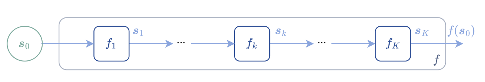]

Sequence of functions
$$
\begin{aligned}
\s\_0 &\in \cS\_0\nonumber \\\\
\s\_1 &\coloneqq f\_1(\s\_0) \in \cS\_1 \\\\
     & \hspace{6pt} \vdots\\\\
\s\_K &\coloneqq f\_K(\s\_{K-1}) \in \cS\_K \\\\
f(\s\_0) &\coloneqq \s\_K
\end{aligned}
$$

Equivalent to function compositions
$$
\begin{aligned}
f(\s\_0)
&= (f\_K \circ \dots \circ f\_2 \circ f\_1)(\s\_0) \\\\
&= f\_K(\dots f\_2(f\_1(\s\_0)))
\end{aligned}
$$

---

## Feedforward networks = parameterized computain chains

.center.width-100[]

$$
\begin{aligned}
\s\_0 &\coloneqq \x \\\\
\s\_1 &\coloneqq f\_1(\s\_0, \w\_1) \\\\
\s\_2 &\coloneqq f\_2(\s\_1, \w\_2) \\\\
&\vdots \\\\
\s\_K &\coloneqq f\_K(\s_{K-1}, \w\_K) \\\\
f(\x, \w) &\coloneqq \s\_K
\end{aligned}
$$

$$
\w \coloneqq (\w\_1, \dots, \w\_K) \in (\cW\_1, \dots, \cW\_K)
$$

---

## Multilayer perceptrons

 

$$
\begin{aligned}
\s\_0 &\coloneqq \x \\\\
\s\_1 &\coloneqq f\_1(\s\_0, \w\_1) \coloneqq a\_1(\bm{W}\_1 \s\_0 + \bm{b}\_1) \\\\
\s\_2 &\coloneqq f\_2(\s\_1, \w\_2) \coloneqq a\_2(\bm{W}\_2 \s\_1 + \bm{b}\_2) \\\\
&\vdots \\\\
\s\_K &\coloneqq f\_K(\s\_{K-1}, \w\_K) \coloneqq a\_K(\bm{W}\_K \s\_{K-1} + \bm{b}\_K)
\end{aligned}
$$
 
where 
* $\w\_k \coloneqq (\bm{W}\_k, \bm{b}\_k)$ are the parameters of layer $k$
* $a_k$ is an activation function (softplus, ReLu, ...)

 

We can see an MLP as a generalized linear model (GLM)  
$\s\_{K-1} \mapsto a\_K(\bm{W}\_K \s\_{K-1} + \bm{b}\_K)$
on top of a learned representation $\s_{K-1}$.

---

## Directed acyclic graphs (DAGs)

.center.width-50[]

Nodes can have parent or children nodes.

DAGs define a **topological order**.

Examples: 
* (0,1,2,3,4)
* (0,2,1,3,4)

---

## Representing programs as DAGs

 

.center.width-100[]

Representation of $f(x_1, x_2) \coloneqq x_2e^{x_1}\sqrt{x_1 + x_2 e^{x_1}}$ as a DAG

 

Functions and variables are nodes.

Edges indicate function and variable dependencies.

The function $f$ is decomposed as $8$ elementary functions in topological order.

---

## Executing a program

 

.center.width-100[]

---

## Representation used in the book

.center.width-70[]

Functions and output variables are represented by the same nodes.

 

## Alternative representation

.center.width-70[]

Functions and variables are represented by a disjoint set of nodes (bipartite graph).

---

## Operators

* Inequality and equality operators
* Soft relaxations
* Logical operators

---

## Heaviside step function

$$
\mathrm{step}(u)
\coloneqq \begin{cases}
    1 &\text{ if } ~ u \ge 0 \\\\
    0 &\text{ otherwise } 
\end{cases}
$$
It is a function from $\RR$ to $\\{0,1\\}$.

 

.center.width-70[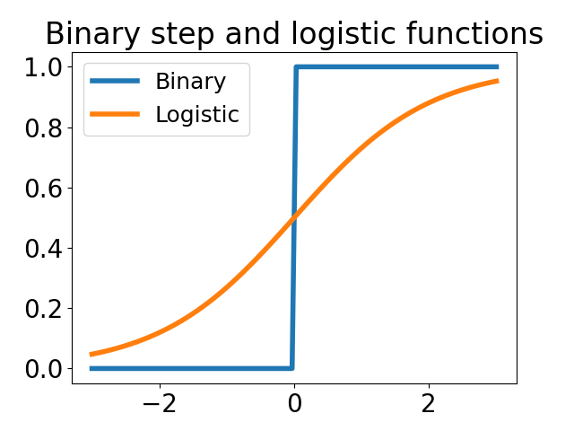]

---

## Inequality operators

Greater than
$$
\mathrm{gt}(u\_1, u\_2)
\coloneqq
\begin{cases}
1 &\text{ if } u\_1 \ge u\_2 \\\\
0 &\text{ otherwise }
\end{cases}
= \mathrm{step}(u\_1 - u\_2)
$$

Less than
$$
\mathrm{lt}(u\_1, u\_2)
\coloneqq
\begin{cases}
1 &\text{ if } u\_1 \le u\_2 \\\\
0 &\text{ otherwise }
\end{cases}
= \mathrm{step}(u\_2 - u\_1)
$$

.center.width-40[]

---

## Equality operators

Equal
$$
\mathrm{eq}(u\_1, u\_2)
\coloneqq
\begin{cases}
1 &\text{ if } |u\_1 - u\_2| = 0 \\\\
0 &\text{ otherwise }
\end{cases}
= \mathrm{step}(u\_2 - u\_1) \cdot \mathrm{step}(u\_1 - u\_2) \\
$$

Not equal
$$
\mathrm{neq}(u\_1, u\_2)
\coloneqq
\begin{cases}
1 &\text{ if } |u\_1 - u\_2| > 0 \\\\
0 &\text{ otherwise }
\end{cases}
= 1 - \mathrm{step}(u\_2 - u\_2) \cdot \mathrm{step}(u\_1 - u\_2)
$$

.center.width-40[]

---

## Sigmoid functions

An "S"-shaped function for squashing $\RR$ to $[0,1]$

Desired properties

* $\mathrm{sigmoid}\_\sigma(-u) = 1 - \mathrm{sigmoid}\_\sigma(u)$
* $\lim\_{u \to \infty} \mathrm{sigmoid}\_\sigma(u) = 1$
* $\lim\_{u \to -\infty} \mathrm{sigmoid}\_\sigma(u) = 0$
* $\mathrm{sigmoid}\_\sigma(0) = \frac{1}{2}$

 

.center.width-50[]

---

## Soft greater than

We can use the **CDF** of a <em>standard</em> logistic or Gaussian distribution:

* Logistic: $\mathrm{sigmoid}_\sigma(u) \coloneqq \frac{1}{1+ e^{-u/\sigma}}$

* Gaussian: $\mathrm{sigmoid}_\sigma(u) \coloneqq \Phi(u/\sigma)
= \frac{1}{2}\left[
    1 + \mathrm{erf}\left(\frac{z}{\sqrt{2}}\right)
\right]$

 

.center.width-50[]

---

## Hard versus soft greater than

$\mathrm{gt}(u\_1, u\_2) = \mathrm{step}(u\_1 - u\_2)$
.center.width-40[]

$\mathrm{gt}\_\sigma(u\_1, u\_2) \coloneqq \mathrm{sigmoid}\_\sigma(u\_1 - u\_2)$
.center.width-40[]

---

## Stochastic perspective (1/2)

Suppose 
$U\_1 \sim p\_{\mu\_1,\sigma\_1}$
and
$U\_2 \sim p\_{\mu\_2,\sigma\_2}$

$$
\begin{aligned}
\mathrm{gt}\_\sigma(\mu\_1, \mu\_2) 
&= \EE\left\[\mathrm{gt}(U\_1, U\_2)\right\] \\\\
&= \EE\left\[\mathrm{step}(U\_1 - U\_2)\right\] \\\\
&= \PP(U\_1 - U\_2 \ge 0) \\\\
&= \PP(U\_2 - U\_1 \le 0) \\\\
&= F_{U\_2 - U\_1}(0)
\end{aligned}
$$

.center.width-50[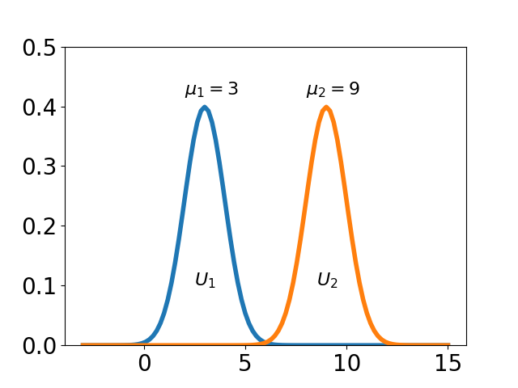]

---

## Stochastic perspective (2/2)

 

If $U\_1 \sim \mathrm{Normal}(\mu\_1, \sigma\_1^2)$
and
$U\_2 \sim \mathrm{Normal}(\mu\_2, \sigma\_2^2)$,
$$
U\_1 - U\_2 \sim \mathrm{Normal}(\mu\_1 - \mu\_2, \sigma\_1^2 + \sigma\_2^2)
$$
$\Rightarrow \mathrm{gt}\_\sigma(\mu\_1, \mu\_2) 
= \Phi\left(\frac{\mu\_1-\mu\_2}{\sigma}\right)$
  

--- 

If 
$U\_1 \sim \mathrm{Gumbel}(\mu\_1, \sigma)$
and
$U\_2 \sim \mathrm{Gumbel}(\mu\_2, \sigma)$,
$$
U\_1 - U\_2 \sim \mathrm{Logistic}(\mu\_1 - \mu\_2, \sigma)
$$
$\Rightarrow \mathrm{gt}\_\sigma(\mu\_1, \mu\_2) 
= \mathrm{logistic}\left(\frac{\mu\_1-\mu\_2}{\sigma}\right)$

---

## Soft equality operators

We can use a normalized kernel
$\kappa\_\sigma$ (logistic, Gaussian) centered on zero.
 
$$
\mathrm{eq}\_\sigma(\mu\_1,\mu\_2) 
\coloneqq
\frac{\kappa\_\sigma(\mu\_1 - \mu\_2)}{\kappa\_\sigma(0)}
$$

 

.center.width-50[]

---

## Stochastic perspective

The kernel corresponds to using the distribution **PDF**

$$
\mathrm{eq}\_\sigma(\mu\_1,\mu\_2) 
= \frac{f\_{U\_1 - U\_2}(0)}{f\_{0}(0)}
$$
where
$$
\begin{aligned}
f\_{U\_1-U\_2}(0)
&= (f\_{U\_1} \ast f\_{-U\_2})(0) \\\\
&= \int\_{-\infty}^\infty f\_{U\_1}(\tau) f\_{-U\_2}(-\tau) d\tau \\\\
&= \int\_{-\infty}^\infty f\_{U\_1}(\tau) f\_{U\_2}(\tau) d\tau \\\\
&\coloneqq \langle f\_{U\_1}, f\_{U\_2} \rangle \\\\
&\coloneqq \kappa(\mu\_1,\mu\_2)
\end{aligned}
$$
(the PDF of the sum of two random variables = **convolution** of the PDFs)

---

## Logical operators

Operators defined on $\\{0,1\\}$

 

$$
\mathrm{and}(\pi, \pi')
\coloneqq
\begin{cases}
1 &\text{ if } \pi = \pi' = 1 \\\\
0 &\text{ otherwise }
\end{cases}
$$

 

$$
\mathrm{or}(\pi, \pi')
\coloneqq
\begin{cases}
    1 &\text{ if } 1 \in \\{\pi, \pi'\\} \\\\
0 &\text{ otherwise }
\end{cases} \\
$$

 

$$
\mathrm{not}(\pi)
\coloneqq
\begin{cases}
0 &\text{ if } \pi = 1 \\\\
1 &\text{ if } \pi = 0
\end{cases}
$$

---

## Continuous extension

We can define the operators on $[0,1]$ instead of $\\{0,1\\}$

 

$$
\begin{aligned}
\mathrm{and}(\pi, \pi') &= \pi \cdot \pi' \\\\
\mathrm{or}(\pi, \pi') &= \pi + \pi' - \pi \cdot \pi' \\\\
\mathrm{not}(\pi) &= 1 - \pi
\end{aligned}
$$

 

.center.width-70[]

---

## Probabilistic interpretation

Le $Y$ and $Y'$ be two independent random variables distributed according to
**Bernoulli** distributions with parameter $\pi$ and $\pi'$.

 

$$
\mathrm{and}(\pi, \pi') = \PP(Y = 1 \cap Y' = 1) 
                        = \PP(Y = 1) \cdot \PP(Y' = 1)
$$

 

$$
\begin{aligned}
\mathrm{or}(\pi, \pi') &= \PP(Y = 1 \cup Y' = 1) \\\\
                       &= \PP(Y=1) + \PP(Y'=1) - \PP(Y = 1 \cap Y' = 1) \\\\
                       &= \PP(Y=1) + \PP(Y'=1) - \PP(Y = 1) \PP(Y' = 1)
\end{aligned}
$$

 

$$
\mathrm{not}(\pi) = \PP(Y \neq 1) = 1 - \PP(Y = 1)
$$

---

## Control flows

* If-else statements ($2$ branches)
* General conditional statements ($K$ branches)
* For loops
* Scan function
* While loops

---

## If-else statements

We can view an if-else as a function $\mathrm{ifelse} \colon \\{0,1\\} \times \cV \times \cV \to \cV$

 

$$
\begin{aligned}
\mathrm{ifelse}(\pi, \v\_1, \v\_0)
&\coloneqq 
\begin{cases}
\v\_1 &\text{ if } \pi = 1 \\\\
\v\_0 &\text{ if } \pi = 0 
\end{cases} \\\\
&= \pi \cdot \v\_1 + (1 - \pi) \cdot \v\_0
\end{aligned}
$$

 

* $\pi$ is called the predicate (**binary** variable)
* $\v\_0$ and $\v\_1$ are the branches (real variables)

---

## Issues with if-else statements

Suppose we want to use
$$
f\_h(p, \u\_1, \u\_0)
\coloneqq
\begin{cases}
g\_1(\u\_1) &\text{ if } p \ge 0 \\\\
g\_0(\u\_0) &\text{ otherwise }
\end{cases}
$$

This can be written as
$$
\begin{aligned}
f\_h(p, \u\_1, \u\_0) 
&\coloneqq \mathrm{ifelse}(\mathrm{gt}(p, 0), g\_1(\u\_1), g\_0(\u\_0)) \\\\
&= \mathrm{ifelse}(\mathrm{step}(p), g\_1(\u\_1), g\_0(\u\_0)) \\\\
&= \mathrm{step}(p) g\_1(\u\_1) + (1 - \mathrm{step}(p)) g\_0(\u\_0)
\end{aligned}
$$

.center.width-40[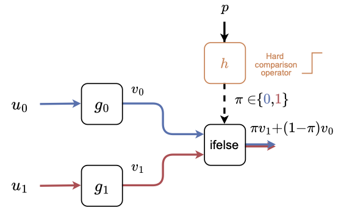]
.center[Problem: there is a **discontinuity** w.r.t. the predicate $p$.]

---

## Continuous relaxation

We can instead consider the relaxation $f\_s \approx f\_h$
$$
\begin{aligned}
f\_s(p, \u\_1, \u\_0) 
&\coloneqq \mathrm{ifelse}(\mathrm{gt}\_\sigma(p, 0), g\_1(\u\_1), g\_0(\u\_0)) \\\\
&= \mathrm{ifelse}(\mathrm{sigmoid}\_\sigma(p), g\_1(\u\_1), g\_0(\u\_0)) \\\\
&= \mathrm{sigmoid}\_\sigma(p) g\_1(\u\_1) + (1 - \mathrm{sigmoid}\_\sigma(p)) g\_0(\u\_0)
\end{aligned}
$$

Probabilistic interpretation
$$
f\_s(p, \u\_1, \u\_0) 
= \EE\_{i \sim \mathrm{Bernoulli}(\mathrm{sigmoid}\_\sigma(p))}\left[g\_i(\u\_i)\right]
$$

.center.width-40[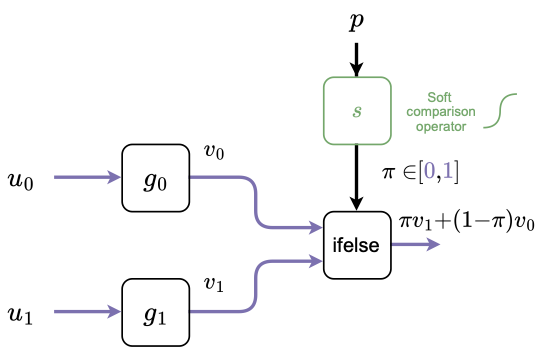]
.center[Continuous and differentiable everywhere w.r.t. the predicate $p$!]

---

## Conditionals with K branches

We can view general conditionals as a function
$\mathrm{cond} \colon \\{\e\_1, \dots, \e\_K\\} \times \cV^K \to \cV$

$$
\begin{aligned}
\mathrm{cond}(\piv, \v\_1, \dots, \v\_K)
&\coloneqq 
\begin{cases}
\v\_1 &\text{ if } \piv = \e\_1 \\\\
\vdots & \\\\
\v\_K &\text{ if } \piv = \e\_K
\end{cases} \\\\
&= \sum_{i=1}^K \pi\_i \v\_i
\end{aligned}
$$
where the selected branch is encoded using a one-hot vector
$$
\bm{e}_i \coloneqq (0, \ldots, 0, \underbrace{1}_i, 0, \ldots, 0).
$$

* $\piv$ is the predicate (**categorical** variable, encoded as a one hot vector)
* $\v\_1, \dots, \v\_K$ are the branches (real variables)

---

## Issues with conditionals

Suppose we want to use
$$
f\_a(\p, \u\_1, \dots, \u\_K) \coloneqq
\begin{cases}
\v\_1 &\text{ if } \mathrm{argmax}(\p) = \e\_1 \\\\
\vdots & \\\\
\v\_K &\text{ if } \mathrm{argmax}(\p) = \e\_K
\end{cases}
$$

 

This can be rewritten as
$$
f\_a(\p, \u\_1, \dots, \u\_K)
\coloneqq
\mathrm{cond}(\mathrm{argmax}(\p), g\_1(\u\_1), \dots, g\_K(\u\_K))
$$

 

**Problem:** the function is discontinuous w.r.t. $\piv \in \\{\e\_1, \dots, \e\_K\\}$

---

## Continuous relaxation

We can instead consider the relaxation $f\_s \approx f\_a$

$$
f\_s(\p, \u\_1, \dots, \u\_K)
\coloneqq
\mathrm{cond}(\mathrm{softargmax}(\p), g\_1(\u\_1), \dots, g\_K(\u\_K))
$$

 

Probabilistic interpretation
$$
f\_s(\p, \u\_1, \dots, \u\_K)
= \EE\_{i \sim \mathrm{Categorical}(\mathrm{softargmax}(\p))}\left[g\_i(\u\_i)\right]
$$

---

## For loops

Sequentially calling a fixed number $K$ of functions, reusing the output from the previous iteration.

.center.width-60[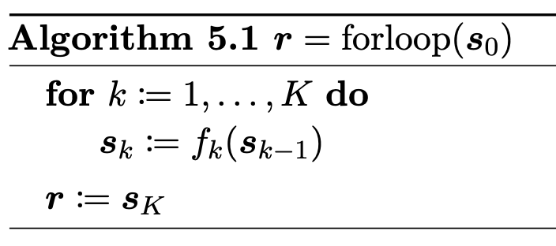]

.center.width-70[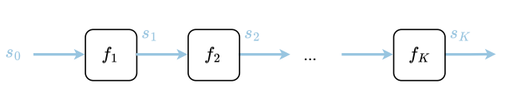]

.center[Feedforward networks are essentially parameterized for loops!]

<!--$$-->
<!--f\_k(\s\_{k-1}) \coloneqq g\_k(\s\_{k-1}, \w\_k)-->
<!--$$-->

---

## Gradient descent as a neural network

Suppose we want to minimize $L(\w, \lambdav)$ w.r.t. $\w \in \cW$, where $\w \in \cW$ are model parameters and $\lambdav \in \Lambda$ are hyper-parameters

 

Gradient descent:
$$
\w\_k \coloneqq \w\_{k-1} - \gamma\_k \nabla\_1 L(\w\_{k-1}, \lambdav)
$$

 

We can therefore see gradient descent as a **parameterized for loop** with

$$
f\_k(\w\_{k-1}) \coloneqq \w\_{k-1} - \gamma\_k \nabla\_1 L(\w\_{k-1}, \lambdav)
$$

---

## Bubble sort as a neural network

.center.width-60[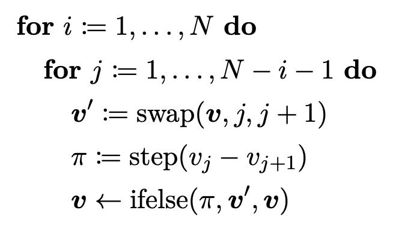]

$$
\textcolor{black}{\mathrm{swap}(\v, i, j) 
\coloneqq \v + (v\_j - v\_i) \e\_i + (v\_i - v\_j) \e\_j}
$$

 

Can be smoothed out by replacing the step function with a sigmoid.

---

## Scan functions

Higher-order function for performing an operation $f$ on individual elements $\u\_k$
while carrying the result $\s\_k$ to the next iteration.

.center.width-70[]

.center.width-70[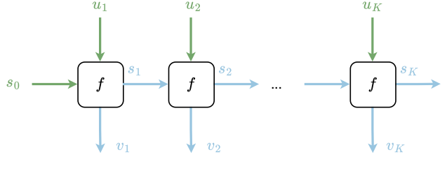]

.center[Seq-to-seq RNNs are essentially parameterized scans!]

---

## While loops

Performs an operation, reusing the output of the previous iteration,
until a certain condition is met.

.center.width-50[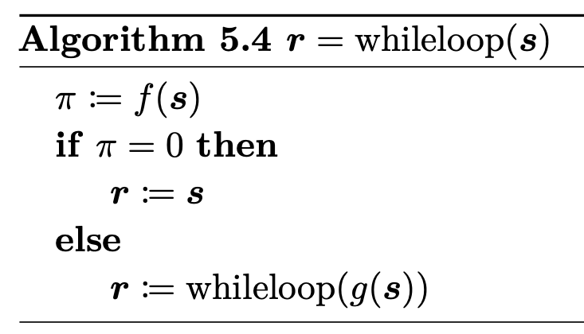]

.center.width-50[]

.center[A while loop forms a **cyclic** graph!]

---

## Unrolled while loop

We can unroll a while loop for $T$ iterations to form an **acyclic** graph (here $T=3$)

.center.width-50[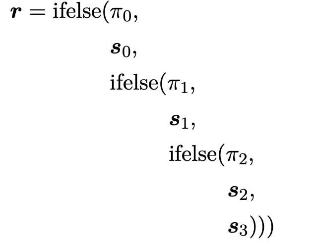]

$$
\textcolor{black}{\bm{r}
= \pi\_0 \s\_0 + 
(1-\pi\_0) \pi\_1 \s\_1 +
(1-\pi\_0) (1- \pi\_1) \pi\_2 \s\_2 +
(1-\pi\_0) (1- \pi\_1) (1 - \pi\_2) \s\_3}
$$

 

$$
\begin{aligned}
  \textcolor{black}{\s\_i} & \textcolor{black}{\coloneqq g(\s\_{i-1})
  \coloneqq \underbrace{g \circ \dots \circ g}\_{i \text{ times}}(\s\_0) \in \cS} \\\\
  \textcolor{black}{\pi\_i} & \textcolor{black}{\coloneqq f(\s\_i) \in \\{0,1\\}}
\end{aligned}
$$
