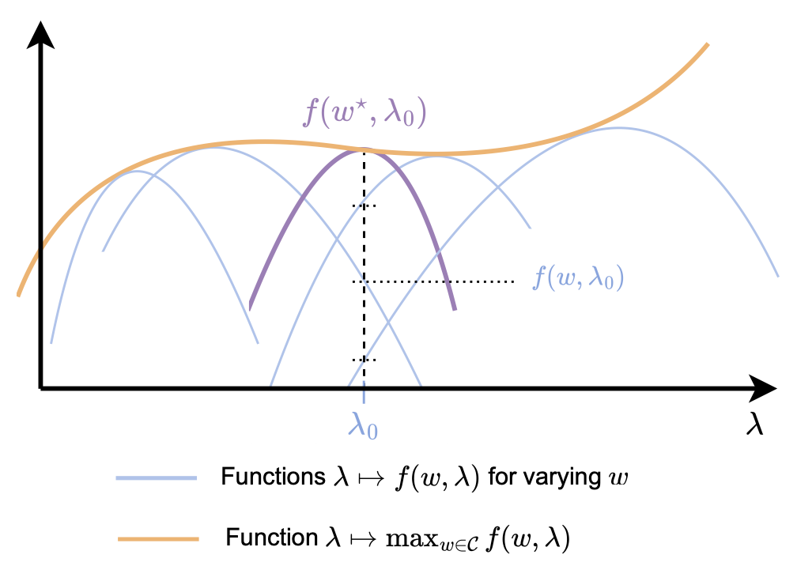

class: middle, center, title-slide

$$
\gdef\jac{\bm{\partial}}
\gdef\e{\bm{e}}
\gdef\p{\bm{p}}
\gdef\r{\bm{r}}
\gdef\s{\bm{s}}
\gdef\t{\bm{t}}
\gdef\u{\bm{u}}
\gdef\v{\bm{v}}
\gdef\w{\bm{w}}
\gdef\x{\bm{x}}
\gdef\y{\bm{y}}
\gdef\piv{\bm{\pi}}
\gdef\lambdav{\bm{\lambda}}
\gdef\thetav{{\bm{\theta}}}
\gdef\muv{\bm{\mu}}
\gdef\deltav{\bm{\delta}}
\gdef\RR{\mathbb{R}}
\gdef\EE{\mathbb{E}}
\gdef\PP{\mathbb{P}}
\gdef\cS{\mathcal{S}}
\gdef\cU{\mathcal{U}}
\gdef\cV{\mathcal{V}}
\gdef\cW{\mathcal{W}}
\gdef\cY{\mathcal{Y}}
\gdef\cZ{\mathcal{Z}}
$$

# The Elements of   Differentiable Programming

**Part III:** Differentiating through programs

  
Mathieu Blondel, Vincent Roulet

---

name: finiteDiff

.center.smaller[**Part III: Differentiating through programs**]

- **Finite differences**
  * Forward and backward differences
  * Truncation versus round-off error
  * Central differences
  * Complex-step derivatives
  * Complexity
- <a class="outline-link" href="#autodiff">Automatic differentiation</a>
- <a class="outline-link" href="#diffThroughOptim">Differentiating through optimization</a>
- <a class="outline-link" href="#diffThroughIntegration">Differentiating through integration</a>

---

## Forward and backward differences

Recall the definition of the directional derivative / JVP as a limit
$$
\partial f(\w)[\v] 
\coloneqq 
\lim_{\delta \rightarrow 0} \frac{f(\w + \delta\v) -f(\w)}{\delta}
$$

 

**Forward difference** 
$$
\partial f(\w)[\v] 
\approx
\frac{f(\w + \delta\v) -f(\w)}{\delta} 
$$

 

**Backward difference**
$$
\partial f(\w)[\v] 
\approx
\frac{f(\w) - f(\w - \delta\v)}{\delta} 
$$

 

.center[$0 < \delta \ll 1$]

---

## Truncation versus round-off error

From the Taylor expansion of $f$
$$
\begin{aligned}
\frac{f(\w+\delta\v) - f(\w)}{\delta}
&= \partial f(\w)[\v] + \frac{\delta}{2} \partial^2 f(\w)[\v, \v] + \frac{\delta^2}{3!} \partial^3 f(\w)[\v, \v, \v] + \dots \\\\
&= \partial f(\w)[\v] + o(\delta)
\end{aligned}
$$

 

**Truncation error**

Error due to using finite rather than infinitesimal $\delta$.

 

**Round-off error**

Error in computing $f(\w+\delta\v) - f(\w)$ due to machine precision.

---

class: middle

.center.width-70[]

 

.center[Numerical differentiation of $f(x) \coloneqq \mathrm{softplus}(x) = \log(1+\exp(x))$
to approximate $f'(x) = \mathrm{logistic}(x)$ at $x=1$.]

---

## Central differences

Use a symmetric formula
$$
\partial f(\w)[\v] 
\approx
\frac{f(\w + \delta\v) - f(\w-\delta\v)}{2\delta}
$$

The truncation error now becomes
$$
\begin{aligned}
\frac{f(\w+\delta\v) - f(\w-\delta\v)}{2\delta}
=& \partial f(\w)[\v] + \frac{\delta^2}{3!} \partial^3 f(\w)[\v, \v, \v] + \ldots\\\\
=& \partial f(\w)[\v] + o(\delta^2)
\end{aligned}
$$

 

.center[The even-order terms cancel out.]

---

## Complex-step derivatives

Suppose $f$ is well defined on $\mathbb{C}$
$$
\begin{aligned}
f(\w+(i \delta)\v) 
=& f(\w) + (i\delta) \partial f(\w)[\v] + \frac{(i\delta)^2}{2} \partial^2 f(\w)[\v, \v] \\\\
 &+ \frac{(i\delta)^3}{3!} \partial^3 f(\w)[\v, \v, \v] + \dots \\\\
=& f(\w) + (i\delta) \partial f(\w)[\v] - \frac{\delta^2}{2} \partial^2 f(\w)[\v, \v] \\\\
 &- \frac{i(\delta)^3}{3!} \partial^3 f(\w)[\v, \v, \v] + \dots
\end{aligned}
$$

We then get
$$
\mathrm{Re}(f(\w+(i \delta)\v))
= f(\w) + o(\delta^2)
$$
and
$$
\mathrm{Im}\left(\frac{f(\w+(i \delta)\v)}{\delta}\right)
= \partial f(\w)[\v] + o(\delta^2)
$$

---

## Complexity

Recall that for a function $f \colon \RR^P \to \RR$
$$
[\nabla f(\w)]_j 
= \langle \nabla f(\w), \e_j \rangle = \partial f(\w)[\e_j]
\quad \forall j \in [P]
$$

 

How many **function calls** are needed to compute the gradient?

 

.center.width-100[]

---

name: autodiff

.center.smaller[**Part III: Differentiating through programs**]

- <a class="outline-link" href="#finiteDiff">Finite differences</a>
- **Automatic differentiation**
  * Computation chains (forward and reverse modes)
  * Computation graphs (forward and reverse modes)
  * Checkpointing
  * Reversible layers
  * Randomized forward-mode estimator
- <a class="outline-link" href="#diffThroughOptim">Differentiating through optimization</a>
- <a class="outline-link" href="#diffThroughIntegration">Differentiating through integration</a>

---

## Computation chains

.center.width-100[]

Sequence of functions
$$
\begin{aligned}
\s\_0 &\in \cS\_0\nonumber \\\\
\s\_1 &\coloneqq f\_1(\s\_0) \in \cS\_1 \\\\
     & \hspace{6pt} \vdots\\\\
\s\_K &\coloneqq f\_K(\s\_{K-1}) \in \cS\_K \\\\
f(\s\_0) &\coloneqq \s\_K
\end{aligned}
$$

Equivalent to function compositions
$$
\begin{aligned}
f(\s\_0)
&= (f\_K \circ \dots \circ f\_2 \circ f\_1)(\s\_0) \\\\
&= f\_K(\dots f\_2(f\_1(\s\_0)))
\end{aligned}
$$

---

## Forward-mode autodiff for computation chains

Computation of the full Jacobian
$$
\jac f(\s\_0) = 
\jac f\_K(\s\_{K-1}) 
\ldots 
\jac f\_1(\s\_0)
$$

 

As a linear map (JVP)
$$
\partial f(\s\_0) 
= 
\partial f\_K(\s\_{K-1})
\circ 
\ldots 
\circ 
\partial f\_1(\s\_0)
$$

 

Applying $\partial f(\s\_0)$ on an **input direction** $\v \in \cS\_0$
$$
\begin{aligned}
\t\_0 & \coloneqq \v \\\\
\t\_1 & \coloneqq \partial f\_1(\s\_0)[\t\_0] \\\\
& \hspace{6pt} \vdots\\\\
\t\_K & \coloneqq \partial f\_K(\s\_{K-1})[\t\_{K-1}]\\\\
\partial f(\s\_0)[\v] &\coloneqq \t\_K
\end{aligned}
$$

---

class: middle

.center.width-100[]

.center.width-100[]

---

## Reverse-mode autodiff for computation chains

Computation of the full Jacobian transpose
$$
\jac f(\s\_0)^\top = 
\jac f\_1(\s\_0)^\top
\ldots 
\jac f\_K(\s\_{K-1})^\top
$$

 

As a linear map (VJP)
$$
\partial f(\s\_0)^\* 
= 
\partial f\_1(\s\_0)^\* 
\circ 
\ldots 
\circ 
\partial f\_K(\s\_{K-1})^\*
$$

 

Applying $\partial f(\s\_0)^\*$ on an **output direction** $\u \in \cS\_K$
$$
\begin{aligned}
\r\_K &\coloneqq \u \\\\
\r\_{K-1} &\coloneqq \partial f\_K(\s\_{K-1})^\*[\r\_K] \\\\
& \hspace{6pt} \vdots \\\\
\r\_0 &\coloneqq \partial f\_1(\s\_0)^\*[\r\_1] \\\\
\partial f(\s\_0)^\*[\u] &\coloneqq \r\_0
\end{aligned}
$$

---

class: middle

.center.width-90[]

.center.width-90[]

---

## Computing entire Jacobians using JVPs and VJPs

Consider a function $f \colon \RR^D \to \RR^M$. Its Jacobian is a $M \times D$ matrix.

 

Extracting the **columns** requires $D$ JVPs with $\e\_j \in \RR^D$
$$
\begin{aligned}
[\jac f(\s\_0)]\_{:,1} &= \partial f(\s\_0)[\e\_1] \\\\
                     &\vdots \\\\
[\jac f(\s\_0)]\_{:,D} &= \partial f(\s\_0)[\e\_D]
\end{aligned}
$$

 

Extracting the **rows** requires $M$ VJPs with $\e\_i \in \RR^M$
$$
\begin{aligned}
[\jac f(\s\_0)]\_{1} &= \partial f(\s\_0)^\*[\e\_1] \\\\
               &\vdots \\\\
[\jac f(\s\_0)]\_{M} &= \partial f(\s\_0)^*[\e_M].
\end{aligned}
$$

---

## What's the best strategy to compute gradients?

Consider a chain of functions $f = f\_K \circ \dots \circ f\_1$ where 
$f\_1 \colon \RR^{D\_0} \to \RR^D$ and $f\_K \colon \RR^{D\_{K-1}} \to \RR$

 

**Forward mode:** we would need $D$ JVPs with $\e\_j \in \RR^D$ for $j \in [D]$
$$
\jac f(\s\_0) \e\_j = 
\jac f\_K(\s\_{K-1}) 
\ldots 
\jac f\_1(\s\_0) \e\_j
$$

 

**Reverse mode:** we need a single VJP with $\e\_1 = 1 \in \RR$

$$
\begin{aligned}
\jac f(\s\_0)^\top \e\_1 &= 
\jac f\_1(\s\_0)^\top
\ldots 
\jac f\_K(\s\_{K-1})^\top \e\_1 \\\\
&= 
(\e\_1^\top
\jac f\_K(\s\_{K-1})
\ldots 
\jac f\_1(\s\_0))^\top \\\\
&= (\e\_1^\top \jac f(\s\_0))^\top
\end{aligned}
$$

---

## Complexity of computing entire Jacobians

Consider a chain of functions $f = f\_K \circ \dots \circ f\_1$ where
$$
\begin{cases}
f\_k \colon \RR^D \to \RR^D &\text{if } \quad k = 1, \dots, K-1 \\\\
f\_K \colon \RR^D \to \RR^M &\text{if } \quad k = K
\end{cases}
$$

 

* If $D > M$, reverse mode is more advantageous at the price of additional memory cost.

* If $M \ge D$, forward mode is more advantageous.

 

.center.width-90[]

---

## Forward-mode autodiff for computation graphs

**Computation chain** 

$f\_k$ takes a **single** input $\s\_{k-1}$  
$\partial f\_k(\s\_k)$ takes a **single** input direction $\t\_{k-1}$

$$
\begin{aligned}
\s\_k &\coloneqq f\_k(\s\_{k-1}) \\\\
\t\_k &\coloneqq \partial f\_k(\s\_{k-1})[\t\_{k-1}]
\end{aligned}
$$

**Computation graph** 

$f\_k$ takes **multiple** inputs $\s\_{i\_1}, \dots, \s\_{i\_{p\_k}}$  
$\partial f\_k(\s\_{i\_1}, \dots, \s\_{i\_{p\_k}})$ takes **multiple** input directions $\t\_{i\_1}, \dots, \t\_{i\_{p\_k}}$  
where $i\_1, \dots, i\_{p\_k} = \mathrm{pa}(k)$ are the parent nodes

$$
\begin{aligned}
\s\_k &\coloneqq f\_k(\s\_{i\_1}, \dots, \s\_{i\_{p\_k}}) \\\\
\t\_k &\coloneqq \partial f\_k(\s\_{i\_1}, \dots, \s\_{i\_{p\_k}})[\t\_{i\_1}, \dots, \t\_{i\_{p\_k}}] \\\\
&= \sum\_{j \in \mathrm{pa}(k)}
\partial\_j f\_k(\s\_{i\_1}, \dots, \s\_{i\_{p\_k}})[\t\_j]
\end{aligned}
$$

---

## Reverse-mode autodiff for computation graphs

**Computation chain** 

$\partial f\_k(\s\_{k-1})^\*$ produces a **single** output direction $\r\_k$
$$
\r\_{k-1} \coloneqq \partial f\_k(\s\_{k-1})^\*[\r\_k]
$$

**Computation graphs**

$\partial f\_k(\s\_{i\_1}, \dots, \s\_{i\_{p\_k}})^\*$ produces **multiple** output variations
$$
\deltav\_{i\_1,k}, \dots, \deltav\_{i\_{p\_k},k} 
= \partial f\_k(\s\_{i\_1}, \ldots, \s\_{i\_{p\_k}})^\*[\r\_k]
$$
where
$$
\deltav\_{j,k} \coloneqq \partial\_j f\_k(\s\_{i\_1}, \ldots, \s\_{i\_{p\_k}})^\*[\r\_k]
$$
We then need to sum the variations
$$
\r\_k
\coloneqq \sum\_{j \in \mathrm{ch}(k)} \partial\_j f\_k(\s\_{i\_1}, \ldots,
\s\_{i\_{p\_k}})^\*[\r\_k]
= \sum\_{j \in \mathrm{ch}(k)} \deltav_{j,k}
$$

---

## Checkpointing

**Reverse mode** 

Time complexity is optimal for scalar-valued functions but we need to store **all** intermediate values.

**Reverse mode with checkpointing**

Trades off computational complexity for better memory, by selectively storing only a **subset** of the intermediate values.

Divide-and-conquer strategies:
* Recursive halving: repeatedly split in half
* Dynamic programming: find optimal splits

.center.width-50[]

---

## Reversible layers

If $f\_k$ is invertible, we can recover $\s\_{k-1}$ from $\s\_k$ by
$$
\s\_{k-1} = f\_k^{-1}(\s\_k)
$$
No need to store the intermediate values!

**Reversible architectures by design**

Reversible residual networks,
orthonormal RNNs,
neural ODEs,
momentum nets,
...

 

.center.width-90[]

---

## Randomized forward-mode estimator

For a function $f \colon \RR^P \to \RR$, forward mode requires $P$ JVPs to compute $\nabla f$.

Can we approximate $\nabla f$ with fewer than $P$ JVPs?

 

$$
\nabla f(\muv)
= \EE\_{Z \sim p} \left[\partial f(\muv)[Z] Z \right]
= \EE\_{Z \sim p} \left[\langle \nabla f(\muv), Z \rangle Z \right]
$$

where $p \coloneqq \mathrm{Normal}(0,1)^P$ is the isotropic Gaussian distribution.

 

**Unbiased** but **high variance** estimator: this slows down the convergence of SGD.

.center.width-65[]

---

name: diffThroughOptim

.center.smaller[**Part III: Differentiating through programs**]

- <a class="outline-link" href="#finiteDiff">Finite differences</a>
- <a class="outline-link" href="#autodiff">Automatic differentiation</a>
- **Differentiating through optimization**
  * Implicit functions
  * Envelope theorems
  * Implicit function theorem
- <a class="outline-link" href="#diffThroughIntegration">Differentiating through integration</a>

---

## Implicit functions

Functions implicitly defined through optimality conditions.

 

*Example 1:* through an **optimization problem**
$$
\w^\star(\lambdav) = \argmax\_{\w \in \cW} f(\w, \lambdav)
$$

 

*Example 2:* through a **nonlinear equation**
$$
F(\w, \lambdav) = \mathbf{0}
$$

 
**Sensivity analysis**

$\w^\star(\lambdav)$ corresponds to the equilibrium state of a
physical system. 

$\partial \w^\star(\lambdav)$ tells us
about the sensitivity of the system to some parameters $\lambdav \in \Lambda$.

---

## Bi-level optimization

$$
h(\lambdav) \coloneqq g(\w^\star(\lambdav), \lambdav)
\quad \text{where} \quad
\w^\star(\lambdav) \coloneqq \argmax\_{\w \in \cW} f(\w, \lambdav)
$$

 

Example: hyperparameter optimization

* $f$: training loss
* $g$: validation loss

 

.center.width-80[]

---

## Envelope theorem, Danskin's theorem

In the special case $f=g$, we get the **maximum** of functions
$$
h(\lambdav) 
= f(\w^\star(\lambdav), \lambdav)
= \max_{\w \in \cW} f(\w, \lambdav)
$$
Then under assumptions on $f$,
$$
\nabla h(\lambdav) = \nabla\_2 f(\w^\star(\lambdav), \lambdav)
$$
We can pretend $\w^\star(\lambdav)$ doesn't depend on $\lambdav$!

.center.width-60[]

---

## Example

Let us define
$$
h(\lambda) \coloneqq \min_{w \in \RR} f(w, \lambda)
\quad \text{where} \quad
f(w, \lambda) \coloneqq \frac{\lambda}{2} w^2 + b w + c, \lambda > 0
$$

 

The derivative of $f$ w.r.t. $\lambda$ is $\frac{1}{2} w^2$

 

From Danskin's theorem, we therefore have 
$$
h'(\lambda) = \frac{1}{2} w^\star(\lambda)
$$
where
$$
w^\star(\lambda) = -\frac{b}{\lambda}
$$

---

## Implicit function theorem: univariate case

Provides **conditions** under which, for an implicit relationship of the form $F(w, \lambda) = 0$, there **exists** 
a function $w = w^\star(\lambda)$ locally in a neighborhood.

Provides a way to compute the derivative of $w^\star(\lambda)$, but not $w^\star(\lambda)$ itself.

**Example: the unit circle** 

$F(x, y) = x^2 + y^2 - 1 = 0$ where $x \equiv w$ and $y \equiv \lambda$

Not a function because for every $y \in [-1, 1]$, $x = \sqrt{1 - y^2}$ or $x = -\sqrt{1 - y^2}$.

But locally around $(x\_0, y\_0)$ for $x\_0 > 0$ and $y\_0 > 0$, we have $x = \sqrt{1 - y^2}$.

---

## Implicit function theorem: univariate case

Let $F \colon \RR \times \RR \to \RR$.
Assume $F(w, \lambda)$ is a continuously differentiable function in a 
neighborhood $\cU$ of $(w\_0, \lambda\_0)$ such that
$F(w\_0, \lambda\_0) = 0$
and
$\partial\_1 F(w\_0, \lambda\_0) \neq 0$.
Then there exists a neighborhood $\cV \subseteq \cU$ of $(w\_0, \lambda\_0)$ in
which there is a function $w^\star(\lambda)$ such that

* $w^\star(\lambda\_0) = w\_0$

* $F(w^\star(\lambda), \lambda) = 0$ for all $\lambda$ in the neighborhood $\cV$

* $\partial w^\star(\lambda) = -\frac{\partial\_2 F(w^\star(\lambda), \lambda)}{
\partial\_1 F(w^\star(\lambda), \lambda)}$

**Example: the unit circle** 

$F(x, y) = x^2 + y^2 - 1 = 0$ where $x \equiv w$ and $y \equiv \lambda$

$$
\partial x^\star(y) 
= -\frac{\partial\_2 F(x^\star(y), y)}{\partial\_1 F(x^\star(y), y)}
= - \frac{2y}{2 x^\star(y)} 
= -\frac{y}{\sqrt{1 - y^2}}
$$
Matches the derivative by chain rule of $\sqrt{1 - y^2}$ on $y \in [0, 1)$.

---

## Implicit function theorem: multivariate case

Let $F \colon \cW \times \Lambda \to \cW$.
Assume $F(\w, \lambdav)$ is a continuously differentiable function in a 
neighborhood of $(\w\_0, \lambdav\_0)$ such that
$F(\w\_0, \lambdav\_0) = \mathbf{0}$
and
$\partial\_1 F(\w\_0, \lambdav\_0)$ is invertible, i.e.,
its determinant is nonzero.
Then there exists a neighborhood of $\lambdav\_0$ in which
there is a function $\w^\star(\lambdav)$ 
such that
* $\w^\star(\lambdav\_0) = \w\_0$

* $F(\w^\star(\lambdav), \lambdav) = \mathbf{0}$ for all $\lambdav$ in the neighborhood

* $-\partial\_1 F(\w^\star(\lambdav), \lambdav)  \partial \w^\star(\lambdav) =  \partial\_2 F(\w^\star(\lambdav),\lambdav)$

$ \iff \partial \w^\star(\lambdav) 
= -\partial\_1 F(\w^\star(\lambdav), \lambdav)^{-1} \partial\_2 F(\w^\star(\lambdav),
\lambdav)$

---

## Example: unconstrained optimization

$$
\w^\star(\lambdav) = \argmin\_{\w \in \RR^P} f(\w, \lambdav)
$$

 

Optimality condition $F(\w, \lambdav) \coloneqq \nabla\_1 f(\w, \lambdav)$

 

$\partial\_1 F(\w, \lambdav) = \nabla^2\_1 f(\w, \lambdav)$ (Hessian of $f$ in $\w$)

$\partial\_2 F(\w, \lambdav) = \partial\_2 \nabla\_1 f(\w, \lambdav)$
(cross derivatives of $f$ in $\w$ and $\lambdav$)

 

From the implicit function theorem (IFT)
$$
\partial \w^\star(\lambdav) = -(\nabla^2\_1 f(\w^\star(\lambdav), \lambdav))^{-1}
 \partial\_2 \nabla\_1 f(\w^\star(\lambdav), \lambdav)
$$

---

## Adjoint state method

Composition of an **explicit** function and an **implicit** function
$$
L(\w) \coloneqq L(\s^\star(\w), \w)
\quad \text{where} \quad
c(\s^\star(\w), \w) = \mathbf{0}
$$

 
Its gradient is given by
$$
\nabla L(\w) = 
\nabla\_2 L(\s^\star(\w), \w) + \partial\_2 c(\s^\star(\w), \w)^\* \r^\star(\w)
$$

 

where $\r^\star(\w)$ is given by the solution of
$$
\partial\_1 c(\s^\star(\w), \w)^\* \r = -\nabla\_1 L(\s^\star(\w), \w)
$$

 
Classically proven using the method of Lagrange multipliers or the IFT.

---

name: diffThroughIntegration

.center.smaller[**Part III: Differentiating through programs**]

- <a class="outline-link" href="#finiteDiff">Finite differences</a>
- <a class="outline-link" href="#autodiff">Automatic differentiation</a>
- <a class="outline-link" href="#diffThroughOptim">Differentiating through optimization</a>
- **Differentiating through integration**
  * Differentiation under the integral sign
  * Differentiating through expectations
  * Score function estimator (REINFORCE)
  * Path gradient estimators
  * Pushforward distributions
  * Change of variable theorem

---

## Differentiation under the integral sign

Consider a function
$$
F(\thetav) \coloneqq \int\_\cY f(\thetav, \y)d\y
$$

 

Provided that we can swap integration and differentiation
$$
\nabla F(\thetav) = \int\_\cY \nabla\_\thetav f(\thetav, \y)d\y
$$

 

The conditions under which we can do this are quite technical.
The most import requirement is that $\thetav \mapsto f(\thetav, \y)$ is absolutely continuous for all $\y \in \cY$.

---

## Differentiating expectations: parameter-independent distributions

The parameters $\thetav$ we want to differentiate are **not involved** in the distribution.
$$
F(\thetav) 
\coloneqq \EE\_{Y \sim p}[g(Y, \thetav)]
= \int\_{\cY} g(\y, \thetav) p(\y) d\y
$$

 
Example: smoothing a differentiable almost everywhere function by perturbation
$$
F(\thetav; \x) \coloneqq \EE\_{Z \sim p}[g(\x + Z, \thetav)]
$$

 

The gradient **is** in expectation form
$$
\begin{aligned}
\nabla F(\thetav)
&= \nabla\_\thetav \int\_{\cY} g(\y, \thetav) p(\y) d\y \\\\
&= \int\_{\cY} \nabla\_\thetav g(\y, \thetav) p(\y) d\y \\\\
&= \EE\_{Y \sim p}[\nabla\_\thetav g(Y, \thetav)]
\end{aligned}
$$

---

## Differentiating expectations: parameter-dependent distributions

The parameters $\thetav$ we want to differentiate are **involved** in the distribution.
$$
E(\thetav) \coloneqq \EE\_{Y \sim p\_\thetav}[g(Y)]
= \int\_{\cY} g(\y) p\_\thetav(\y) d\y
$$

 
Example: reinforcement learning (RL)
$$
E(\thetav; \x) \coloneqq \EE\_{Y \sim p\_\thetav}[\mathrm{reward}(\x, Y)]
$$

 

The gradient **is not** in expectation form
$$
\nabla E(\thetav) 
= \nabla\_\thetav \int\_{\cY} p\_\thetav(\y) g(\y) d\y
= \int\_{\cY} \nabla\_\thetav p\_\thetav(\y) g(\y) d\y
$$

---

## Score function estimator

Using the logarithmic derivative identity
$$
\nabla\_\thetav \log p\_\thetav(\y) 
= \frac{\nabla\_\thetav p\_\thetav(\y)}{p\_\thetav(\y)}
\Longleftrightarrow
\nabla\_\thetav p\_\thetav(\y)
= 
p\_\thetav(\y)
\nabla\_\thetav \log p\_\thetav(\y)
$$

 

we can rewrite the gradient of
$$
E(\thetav) 
\coloneqq \EE\_{Y \sim p\_\thetav}[g(Y)]
= \int\_\cY p\_\thetav(\y) g(\y) d\y
$$
as
$$
\nabla E(\thetav)
= \EE\_{Y \sim \p\_\thetav}[g(Y) \nabla\_\thetav \log p\_\thetav(Y)]
$$

---

## Pathwise gradient estimator: an example

Suppose we want to differentiate
$$
E(\mu, \sigma)
\coloneqq \EE\_{U \sim \mathrm{Normal}(\mu, \sigma^2)}[g(U)]
$$
Using
$$
U \sim \mathrm{Normal}(\mu, \sigma^2)
\iff
\mu + \sigma Z \qquad Z \sim \mathrm{Normal}(0, 1)
$$
we obtain
$$
E(\mu, \sigma) 
= \EE\_{Z \sim \mathrm{Normal}(0, 1)}[g(\mu + \sigma Z)]
$$
and therefore
$$
\begin{aligned}
\frac{\partial}{\partial \mu} E(\mu, \sigma) 
&= \EE\_{Z \sim \mathrm{Normal}(0, 1)}[g'(\mu + \sigma Z)] \\\\
\frac{\partial}{\partial \sigma} E(\mu, \sigma) 
&= \sigma \cdot \EE\_{Z \sim \mathrm{Normal}(0, 1)}[g'(\mu + \sigma Z)]
\end{aligned}
$$

---

## Location-scale transforms

Location-scale family distributions  $p\_{\muv, \sigma}$ with location $\muv$ and scale $\sigma$ satisfy
$$
U \sim p\_{\muv, \sigma} 
\iff
\mu + \sigma Z \qquad Z \sim p\_{\mathbf{0}, 1}
$$

 

Examples:
* Cauchy distribution
* uniform distribution
* logistic distribution
* Laplace distribution
* Student's $t$-distribution

---

## Pathwise gradient estimator: differentiable transforms

Suppose $U \coloneqq T(Z, \thetav)$, where $T$ is a differentiable transform.

 

Let us define
$$
E(\thetav) \coloneqq \EE\_{U \sim p\_\thetav}[g(U)]
= \EE\_{Z \sim p}[g(T(Z, \thetav))]
$$

 

Then
$$
\nabla E(\thetav) 
=
\EE\_{Z \sim p}[\partial\_2 T(Z, \thetav)^\* \nabla g(T(Z, \thetav))]
$$

---

## SFE versus PGE

**Score function estimator (SFE)**
- Needs to sample from $p\_\thetav$
- Need $\log p\_\thetav(\y)$
- Blackbox access to $g$
- $g$ can be defined on $\cY$
- High variance

**Path gradient estimator (PGE)**
- Needs to sample from $p\_\thetav$ (after change of variable)
- No need for $\log p\_\thetav(\y)$
- Needs access to $\nabla g$
- $g$ needs to be well-defined on $\mathrm{conv}(\cY)$
- Low variance

---

## Pushforward distributions: from explicit to implicit distributions

Suppose $Z \sim p$, where $p$ is a distribution over $\cZ$. 
Given a continuous map $T \colon \cZ \to \cU$, 
the pushforward distribution of $p$ through $T$
is the distribution $q$ according to which 
$U \coloneqq T(Z) \in \cU$ is distributed, 
i.e., $U \sim q$.

 

**Easy to sample from**

$$
U \sim q
\iff
Z \sim p, U \coloneqq T(Z)
$$

 

--

**Easy to compute expectations by Monte-Carlo**
$$
\EE\_{U \sim q}[f(U)] 
= \EE\_{Z \sim p}[f(T(Z))]
$$

---

## Change of variables theorem: from implicit to explicit distributions

Suppose
$Z \sim p$, where $p$ is a distribution over $\cZ$, with PDF $p\_Z$. 

Let $T \colon \cZ \to \cU$ be a **diffeomorphism**
(i.e., an invertible and differentiable map).

The pushforward distribution of $p$ through $T$ is the distribution $q$ 
such that 
$$
U \coloneqq T(Z) \sim q
$$
and its PDF is
$$
q\_U(\u) = |\det(\partial T^{-1}(\u))| p\_Z(T^{-1}(\u))
$$
where $\partial T^{-1}(\u)$ is the Jacobian of $T^{-1} \colon \cU \to \cZ$.

 

**Normalizing flows** are parametrized transformations $T$ designed such that
$T^{-1}$ and its Jacobian $\partial T^{-1}$ are easy to compute.

---

class: middle

.center.width-90[]

 

.center[See *stochastic computation graphs* part of the book for more details.]
