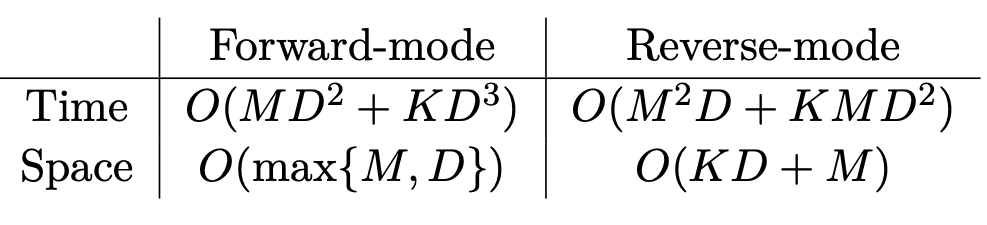

class: middle, center, title-slide

$$
\gdef\jac{\bm{\partial}}
\gdef\e{\bm{e}}
\gdef\p{\bm{p}}
\gdef\r{\bm{r}}
\gdef\s{\bm{s}}
\gdef\t{\bm{t}}
\gdef\u{\bm{u}}
\gdef\v{\bm{v}}
\gdef\w{\bm{w}}
\gdef\x{\bm{x}}
\gdef\piv{\bm{\pi}}
\gdef\lambdav{\bm{\lambda}}
\gdef\deltav{\bm{\delta}}
\gdef\RR{\mathbb{R}}
\gdef\EE{\mathbb{E}}
\gdef\PP{\mathbb{P}}
\gdef\cS{\mathcal{S}}
\gdef\cV{\mathcal{V}}
\gdef\cW{\mathcal{W}}
$$

# The Elements of   Differentiable Programming

**Lecture 3:** Differentiating through programs

  
Mathieu Blondel, Vincent Roulet

---

# Outline

- **Finite differences**
  * Forward and backward differences
  * Truncation versus round-off error
  * Central differences
  * Complex-step derivatives
  * Complexity
- Automatic differentiation
- Differentiating through optimization
- Differentiating through integration

---

## Forward and backward differences

Recall the definition of the directional derivative / JVP as a limit
$$
\partial f(\w)[\v] 
\coloneqq 
\lim_{\delta \rightarrow 0} \frac{f(\w + \delta\v) -f(\w)}{\delta}
$$

 

**Forward difference** 
$$
\partial f(\w)[\v] 
\approx
\frac{f(\w + \delta\v) -f(\w)}{\delta} 
$$

 

**Backward difference**
$$
\partial f(\w)[\v] 
\approx
\frac{f(\w) - f(\w - \delta\v)}{\delta} 
$$

 

.center[$0 < \delta \ll 1$]

---

## Truncation versus round-off error

From the Taylor expansion of $f$
$$
\begin{aligned}
\frac{f(\w+\delta\v) - f(\w)}{\delta}
&= \partial f(\w)[\v] + \frac{\delta}{2} \partial^2 f(\w)[\v, \v] + \frac{\delta^2}{3!} \partial^3 f(\w)[\v, \v, \v] + \dots \\\\
&= \partial f(\w)[\v] + o(\delta)
\end{aligned}
$$

 

**Truncation error**

Error due to using finite rather than infinitesimal $\delta$.

 

**Round-off error**

Error in computing $f(\w+\delta\v) - f(\w)$ due to machine precision.

---

class: middle

.center.width-70[]

 

.center[Numerical differentiation of $f(x) \coloneqq \mathrm{softplus}(x) = \log(1+\exp(x))$
to approximate $f'(x) = \mathrm{logistic}(x)$ at $x=1$.]

---

## Central differences

Use a symmetric formula
$$
\partial f(\w)[\v] 
\approx
\frac{f(\w + \delta\v) - f(\w-\delta\v)}{2\delta}
$$

The truncation error now becomes
$$
\begin{aligned}
\frac{f(\w+\delta\v) - f(\w-\delta\v)}{2\delta}
=& \partial f(\w)[\v] + \frac{\delta^2}{3!} \partial^3 f(\w)[\v, \v, \v] + \ldots\\\\
=& \partial f(\w)[\v] + o(\delta^2)
\end{aligned}
$$

 

.center[The even-order terms cancel out.]

---

## Complex-step derivatives

Suppose $f$ is well defined on $\mathbb{C}$
$$
\begin{aligned}
f(\w+(i \delta)\v) 
=& f(\w) + (i\delta) \partial f(\w)[\v] + \frac{(i\delta)^2}{2} \partial^2 f(\w)[\v, \v] \\\\
 &+ \frac{(i\delta)^3}{3!} \partial^3 f(\w)[\v, \v, \v] + \dots \\\\
=& f(\w) + (i\delta) \partial f(\w)[\v] - \frac{\delta^2}{2} \partial^2 f(\w)[\v, \v] \\\\
 &- \frac{i(\delta)^3}{3!} \partial^3 f(\w)[\v, \v, \v] + \dots
\end{aligned}
$$

We then get
$$
\mathrm{Re}(f(\w+(i \delta)\v))
= f(\w) + o(\delta^2)
$$
and
$$
\mathrm{Im}\left(\frac{f(\w+(i \delta)\v)}{\delta}\right)
= \partial f(\w)[\v] + o(\delta^2)
$$

---

## Complexity

Recall that for a function $f \colon \RR^P \to \RR$
$$
[\nabla f(\w)]_j 
= \langle \nabla f(\w), \e_j \rangle = \partial f(\w)[\e_j]
\quad \forall j \in [P]
$$

 

How many **function calls** are needed to compute the gradient?

 

.center.width-100[]

---

# Outline

- Finite differences
- **Automatic differentiation**
  * Computation chains (forward and reverse modes)
  * Computation graphs (forward and reverse modes)
  * Checkpointing
  * Reversible layers
  * Randomized forward-mode estimator
- Differentiating through optimization
- Differentiating through integration

---

## Computation chains

.center.width-100[]

Sequence of functions
$$
\begin{aligned}
\s\_0 &\in \cS\_0\nonumber \\\\
\s\_1 &\coloneqq f\_1(\s\_0) \in \cS\_1 \\\\
     & \hspace{6pt} \vdots\\\\
\s\_K &\coloneqq f\_K(\s\_{K-1}) \in \cS\_K \\\\
f(\s\_0) &\coloneqq \s\_K
\end{aligned}
$$

Equivalent to function compositions
$$
\begin{aligned}
f(\s\_0)
&= (f\_K \circ \dots \circ f\_2 \circ f\_1)(\s\_0) \\\\
&= f\_K(\dots f\_2(f\_1(\s\_0)))
\end{aligned}
$$

---

## Forward-mode autodiff for computation chains

Computation of the full Jacobian
$$
\jac f(\s\_0) = 
\jac f\_K(\s\_{K-1}) 
\ldots 
\jac f\_1(\s\_0)
$$

 

As a linear map (JVP)
$$
\partial f(\s\_0) 
= 
\partial f\_K(\s\_{K-1})
\circ 
\ldots 
\circ 
\partial f\_1(\s\_0)
$$

 

Applying $\partial f(\s\_0)$ on an **input direction** $\v \in \cS\_0$
$$
\begin{aligned}
\t\_0 & \coloneqq \v \\\\
\t\_1 & \coloneqq \partial f\_1(\s\_0)[\t\_0] \\\\
& \hspace{6pt} \vdots\\\\
\t\_K & \coloneqq \partial f\_K(\s\_{K-1})[\t\_{K-1}]\\\\
\partial f(\s\_0)[\v] &\coloneqq \t\_K
\end{aligned}
$$

---

class: middle

.center.width-100[]

.center.width-100[]

---

## Reverse-mode autodiff for computation chains

Computation of the full Jacobian transpose
$$
\jac f(\s\_0)^\top = 
\jac f\_1(\s\_0)^\top
\ldots 
\jac f\_K(\s\_{K-1})^\top
$$

 

As a linear map (VJP)
$$
\partial f(\s\_0)^\* 
= 
\partial f\_1(\s\_0)^\* 
\circ 
\ldots 
\circ 
\partial f\_K(\s\_{K-1})^\*
$$

 

Applying $\partial f(\s\_0)^\*$ on an **output direction** $\u \in \cS\_K$
$$
\begin{aligned}
\r\_K &\coloneqq \u \\\\
\r\_{K-1} &\coloneqq \partial f\_K(\s\_{K-1})^\*[\r\_K] \\\\
& \hspace{6pt} \vdots \\\\
\r\_0 &\coloneqq \partial f\_1(\s\_0)^\*[\r\_1] \\\\
\partial f(\s\_0)^\*[\u] &\coloneqq \r\_0
\end{aligned}
$$

---

class: middle

.center.width-90[]

.center.width-90[]

---

## Computing entire Jacobians using JVPs and VJPs

Consider a function $f \colon \RR^D \to \RR^M$. Its Jacobian is a $M \times D$ matrix.

 

Extracting the **columns** requires $D$ JVPs with $\e\_j \in \RR^D$
$$
\begin{aligned}
[\jac f(\s\_0)]\_{:,1} &= \partial f(\s\_0)[\e\_1] \\\\
                     &\vdots \\\\
[\jac f(\s\_0)]\_{:,D} &= \partial f(\s\_0)[\e\_D]
\end{aligned}
$$

 

Extracting the **rows** requires $M$ VJPs with $\e\_i \in \RR^M$
$$
\begin{aligned}
[\jac f(\s\_0)]\_{1} &= \partial f(\s\_0)^\*[\e\_1] \\\\
               &\vdots \\\\
[\jac f(\s\_0)]\_{M} &= \partial f(\s\_0)^*[\e_M].
\end{aligned}
$$

---

## What's the best strategy to compute gradients?

Consider a chain of functions $f = f\_K \circ \dots \circ f\_1$ where 
$f\_1 \colon \RR^{D\_0} \to \RR^D$ and $f\_K \colon \RR^{D\_{K-1}} \to \RR$

 

**Forward mode:** we would need $D$ JVPs with $\e\_j \in \RR^D$ for $j \in [D]$
$$
\jac f(\s\_0) \e\_j = 
\jac f\_K(\s\_{K-1}) 
\ldots 
\jac f\_1(\s\_0) \e\_j
$$

 

**Reverse mode:** we need a single VJP with $\e\_1 = 1 \in \RR$

$$
\begin{aligned}
\jac f(\s\_0)^\top \e\_1 &= 
\jac f\_1(\s\_0)^\top
\ldots 
\jac f\_K(\s\_{K-1})^\top \e\_1 \\\\
&= 
(\e\_1^\top
\jac f\_K(\s\_{K-1})
\ldots 
\jac f\_1(\s\_0))^\top \\\\
&= (\e\_1^\top \jac f(\s\_0))^\top
\end{aligned}
$$

---

## Complexity of computing entire Jacobians

Consider a chain of functions $f = f\_K \circ \dots \circ f\_1$ where
$$
\begin{cases}
f\_k \colon \RR^D \to \RR^D &\text{if } \quad k = 1, \dots, K-1 \\\\
f\_K \colon \RR^D \to \RR^M &\text{if } \quad k = K
\end{cases}
$$

 

* If $D > M$, reverse mode is more advantageous at the price of additional memory cost.

* If $M \ge D$, forward mode is more advantageous.

 

.center.width-90[]

---

## Forward-mode autodiff for computation graphs

**Computation chain** 

$f\_k$ takes a **single** input $\s\_{k-1}$  
$\partial f\_k(\s\_k)$ takes a **single** input direction $\t\_{k-1}$

$$
\begin{aligned}
\s\_k &\coloneqq f\_k(\s\_{k-1}) \\\\
\t\_k &\coloneqq \partial f\_k(\s\_{k-1})[\t\_{k-1}]
\end{aligned}
$$

**Computation graph** 

$f\_k$ takes **multiple** inputs $\s\_{i\_1}, \dots, \s\_{i\_{p\_k}}$  
$\partial f\_k(\s\_{i\_1}, \dots, \s\_{i\_{p\_k}})$ takes **multiple** input directions $\t\_{i\_1}, \dots, \t\_{i\_{p\_k}}$  
where $i\_1, \dots, i\_{p\_k} = \mathrm{pa}(k)$ are the parent nodes

$$
\begin{aligned}
\s\_k &\coloneqq f\_k(\s\_{i\_1}, \dots, \s\_{i\_{p\_k}}) \\\\
\t\_k &\coloneqq \partial f\_k(\s\_{i\_1}, \dots, \s\_{i\_{p\_k}})[\t\_{i\_1}, \dots, \t\_{i\_{p\_k}}] \\\\
&= \sum\_{j \in \mathrm{pa}(k)}
\partial\_j f\_k(\s\_{i\_1}, \dots, \s\_{i\_{p\_k}})[\t\_j]
\end{aligned}
$$

---

## Reverse-mode autodiff for computation graphs

**Computation chain** 

$\partial f\_k(\s\_{k-1})^\*$ produces a **single** output direction $\r\_k$
$$
\r\_{k-1} \coloneqq \partial f\_k(\s\_{k-1})^\*[\r\_k]
$$

**Computation graphs**

$\partial f\_k(\s\_{i\_1}, \dots, \s\_{i\_{p\_k}})^\*$ produces **multiple** output variations
$$
\deltav\_{i\_1,k}, \dots, \deltav\_{i\_{p\_k},k} 
= \partial f\_k(\s\_{i\_1}, \ldots, \s\_{i\_{p\_k}})^\*[\r\_k]
$$
where
$$
\deltav\_{j,k} \coloneqq \partial\_j f\_k(\s\_{i\_1}, \ldots, \s\_{i\_{p\_k}})^\*[\r\_k]
$$
We then need to sum the variations
$$
\r\_k
\coloneqq \sum\_{j \in \mathrm{ch}(k)} \partial\_j f\_k(\s\_{i\_1}, \ldots,
\s\_{i\_{p\_k}})^\*[\r\_k]
= \sum\_{j \in \mathrm{ch}(k)} \deltav_{j,k}
$$

---

## Checkpointing

**Reverse mode** 

Time complexity is optimal for scalar-valued functions but we need to store **all** intermediate values.

**Reverse mode with checkpointing**

Trades off computational complexity for better memory, by selectively storing only a **subset** of the intermediate values.

Divide-and-conquer strategies:
* Recursive halving: repeatedly split in half
* Dynamic programming: find optimal splits

---

## Reversible layers

If $f\_k$ is invertible, we can recover $\s\_{k-1}$ from $\s\_k$ by
$$
\s\_{k-1} = f\_k^{-1}(\s\_k)
$$
No need to store the intermediate values!

**Reversible architectures by design**

Reversible residual networks,
orthonormal RNNs,
neural ODEs,
momentum nets,
...

 

.center.width-90[]
