class: middle, center, title-slide

$$
\gdef\a{\bm{a}}
\gdef\b{\bm{b}}
\gdef\e{\bm{e}}
\gdef\u{\bm{u}}
\gdef\v{\bm{v}}
\gdef\x{\bm{x}}
\gdef\y{\bm{y}}
\gdef\w{\bm{w}}
\gdef\muv{{\bm{\mu}}}
\gdef\thetav{{\bm{\theta}}}
\gdef\lambdav{{\bm{\lambda}}}
\gdef\piv{{\bm{\pi}}}
\gdef\RR{\mathbb{R}}
\gdef\EE{\mathbb{E}}
\gdef\VV{\mathbb{V}}
\gdef\PP{\mathbb{P}}
\gdef\NN{\mathbb{N}}
\gdef\jac{\bm{\partial}}
\gdef\cE{\mathcal{E}}
\gdef\cF{\mathcal{F}}
\gdef\cG{\mathcal{G}}
\gdef\cW{\mathcal{W}}
\gdef\cX{\mathcal{X}}
\gdef\cY{\mathcal{Y}}
$$

# The Elements of   Differentiable Programming

**Part I: Fundamentals**

  
Mathieu Blondel, Vincent Roulet

---

name: diff

.center.smaller[**Part I: Fundamentals**]

- **Differentiation**
  * Continuous functions
  * Differentiable functions
  * Gradients
  * Jacobians
  * Linear maps: JVPs and VJPs
  * Hessians and Hessian-vector products (HVPs)
- <a class="outline-link" href="#probaLearning">Probabilistic learning</a>

---

## Continuous functions

A function
$f:\mathbb{R} \rightarrow \mathbb{R}$ is continuous at a point $w \in \mathbb{R}$ if 
$$
\lim_{v \rightarrow w} f(v) = f(w).
$$

A function $f$ is said to be continuous if it is continuous at all points
in its domain.

 

.center.width-100[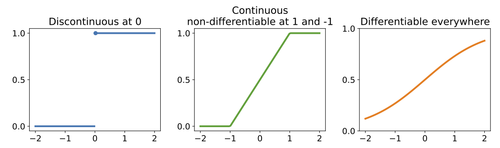]

---

## Differentiable functions

The derivative of $f: \mathbb{R} \rightarrow \mathbb{R}$ at $w \in \mathbb{R}$ is defined as
$$
f'(w) \coloneqq \lim_{\delta\rightarrow 0} \frac{f(w+\delta)- f(w)}{\delta}
$$
provided that the limit exists.
If $f'(w)$ is well-defined at a particular
$w$, we say that the function $f$ is differentiable at $w$.

 

.center.width-50[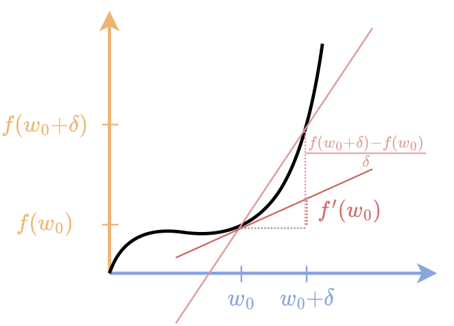]

---

## Calculus rules

- Linearity: $\forall a, b \in \mathbb{R}, \ (af+bg)'(w) = af'(w) +bg'(w)$ 

- Product rule: $(fg)'(w) = f'(w) g(w) + f(w)g'(w)$

- Chain rule: $(f\circ g)'(w) = f'(g(w)) g'(w)$, where
$(f\circ g)(w) \coloneqq f(g(w))$

 

As the linearity and the product rules can be rederived from 
the chain rule, the chain rule can be seen as the cornerstone of differentiation.

---

## Leibniz notation

Suppose $u \coloneqq f(w)$

- Lagrange notation: $f'(w)$
- Leibniz notation: $f' = \frac{du}{dw}$

--

 

Now suppose $v \coloneqq g(w)$ and $u \coloneqq f(v)$

- Lagrange notation: $(f\circ g)'(w) = f'(g(w)) g'(w)$
- Leibniz notation: $\frac{du}{dw} = \frac{du}{dv} \cdot \frac{dv}{dw}$

---

## Directional derivatives

The directional derivative
of
$f \colon \mathbb{R}^P \to \mathbb{R}$ 
at 
$\bm{w} = (w\_1, ..., w\_P) \in \mathbb{R}^P$
in the direction $\bm{v} \in \mathbb{R}^P$ is given by 
$$
\partial f(\bm{w})[\bm{v}] \coloneqq \lim_{\delta \rightarrow 0} \frac{f(\bm{w} + \delta \bm{v}) - f(\bm{w})}{\delta},
$$
provided that the limit exists. 

 

.center.width-50[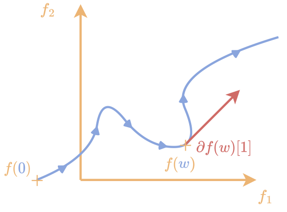]

*Directional derivative of the curve 
$f:\mathbb{R} \rightarrow \mathbb{R}^2$ in direction $v=1$ is the tangent*

---

## Partial derivatives

- The partial derivative for $i \in [P]$
$$
\partial\_i f(\bm{w}) 
\coloneqq \partial f(\bm{w})[\bm{e}\_i] 
= \lim_{\delta \rightarrow 0} \frac{f(\bm{w} + \delta \bm{e}\_i) - f(\bm{w})}{\delta}
$$
where
$$
\bm{e}_i \coloneqq (0, \ldots, 0, \underbrace{1}_i, 0, \ldots, 0).
$$

--

- Also denoted $\frac{\partial f(\bm{w})}{\partial w\_i}$ or $\partial\_{w\_i} f(\bm{w})$

--

- As if we are differentiating a function $\omega\_i \mapsto f(w\_1, \ldots,
\omega\_i, \ldots, w\_P)$ around $\omega\_i$, letting all other coordinates fixed
at their values $w\_i$.

---

## Gradients

The gradient of a differentiable function $f: \mathbb{R}^P \rightarrow \mathbb{R}$
at a point $\bm{w} \in \mathbb{R}^P$ is defined as the vector of partial derivatives

$$
\nabla f(\bm{w}) 
\coloneqq \begin{pmatrix} \partial\_1 f(\bm{w}) \\\\
  \vdots \\\\
  \partial\_P f(\bm{w}) \end{pmatrix}
  = \begin{pmatrix} \partial f(\bm{w})[\bm{e}\_1] \\\\
  \vdots \\\\
  \partial f(\bm{w})[\bm{e}\_P] \end{pmatrix} \in \mathbb{R}^P
$$

--

  

Using $\bm{v}=\sum_{i=1}^P v\_i \bm{e}\_i$ and the linearity of the directional derivative:

$\partial f(\bm{w})[\bm{v}] 
= \sum_{i=1}^P v\_i \partial f(\bm{w})[\bm{e}\_i]
= \langle \bm{v}, \nabla f(\bm{w})\rangle$

---

## Why is the gradient useful?

We say that $\bm{v}$ is an **ascent direction** of $f$ from $\bm{w}$ if
$$
\langle \bm{v}, \nabla f(\bm{w}) \rangle > 0.
$$

--

We can then seek the **steepest ascent direction**
$$
\argmax\_{\bm{v} \in \mathbb{R}^P, \\|\bm{v}\\|\_2 \leq 1}
\langle \bm{v}, \nabla f(\bm{w}) \rangle
= \argmax\_{\bm{v} \in \mathbb{R}^P, \\|\bm{v}\\|\_2 \le 1}
\partial f(\bm{w})[\bm{v}]
= \frac{\nabla f(\bm{w})}{\\|\nabla f(\bm{w})\\|\_2}
$$

 

.center.width-50[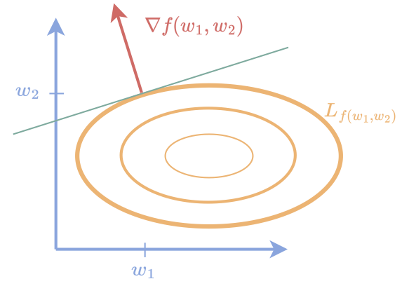]

---

## Jacobians

The Jacobian of a differentiable function $f: \mathbb{R}^P \rightarrow \mathbb{R}^M$ at $\bm{w}$ is
defined as the matrix gathering partial derivatives of each coordinate's function

$$
\bm{\partial} f (\bm{w}) 
\coloneqq \begin{pmatrix}
        \partial\_1 f\_1(\bm{w}) & \ldots & \partial\_P f\_1(\bm{w}) \\\\
        \vdots & \ddots & \vdots \\\\
        \partial\_1 f\_M(\bm{w}) & \ldots & \partial\_P f\_M(\bm{w})
    \end{pmatrix} \in \mathbb{R}^{M \times P}
$$

 

--

The Jacobian can be represented by stacking columns of partial derivatives or rows
of gradients,
$$
\bm{\partial} f (\w) 
= \begin{pmatrix}
        \partial\_1 f(\w), \ldots, \partial\_P f(\w)
    \end{pmatrix} 
  = \begin{pmatrix}
    \nabla f\_1(\w)^\top \\\\
    \vdots \\\\
    \nabla f\_M(\w)^\top
    \end{pmatrix} \in \mathbb{R}^{M \times P}
$$

--

 

Careful: if $f: \mathbb{R}^P \rightarrow \mathbb{R}$, then
$\jac f(\w) = \nabla f(\w)^\top \in \RR^{1\times P}$

---

## Example: Jacobian of an element-wise activation function σ

Suppose $f \colon \RR^P \to \RR^P$ is defined as
$$
f(\w) 
\coloneqq \begin{pmatrix}
    \sigma(w\_1) \\\\
    \vdots \\\\
    \sigma(w\_P)
\end{pmatrix}\in \RR^P
$$
Then
$$
\bm{\partial} f(\w) 
= \mathrm{diag}(\sigma'(w\_1), \dots, \sigma'(w\_P))
\coloneqq \begin{pmatrix}
    \sigma'(w\_1) & 0 & \ldots & 0 \\\\
    0 & \ddots & \ddots & \vdots \\\\
    \vdots & \ddots & \ddots & 0 \\\\
    0 & \ldots & 0 & \sigma'(w\_P)
\end{pmatrix} \in \RR^{P \times P}
$$

---

## Chain rule

 

Consider $f:\RR^P \rightarrow\RR^M$ and $g:\RR^M \rightarrow \RR^R$. Then,
$$
\underbrace{\jac (g\circ f)(\w)}\_{\RR^{R \times P}} = \underbrace{\jac g(f(\w))}\_{\RR^{R \times M}} \underbrace{\jac f(\w)}\_{\RR^{M \times P}}
$$

*Example:* $f$ a layer, $g$ another layer

--

--- 

 

Consider $f:\RR^P \rightarrow\RR^M$ and $L:\RR^M \rightarrow \RR$. Then,
$$
\nabla (L \circ f)(\w) 
= \Big(\underbrace{\jac L(f(\w))}\_{\RR^{1 \times M}} \underbrace{\jac f(\w)}\_{\RR^{M \times P}}\Big)^\top
= \underbrace{\jac f(\w)^\top}\_{\RR^{P \times M}} \underbrace{\nabla L(f(\w))}\_{\RR^{M \times 1}}
$$

*Example:* $L$: loss function, $f$: neural network

---

## The need for linear maps

Suppose we want to differentiate a function $f \colon \RR^{M \times D} \to \RR^M$ defined by
$$f(\bm{W}) \coloneqq \bm{W} \x$$
where $\bm{W} \in \RR^{M \times D}$ and $\x \in \RR^D$

--

We could always differentiate $\tilde{f}(\w)$ where $\w \coloneqq \mathrm{vec}(\bm{W}) \in \RR^{MD}$

--

However, the Jacobian $\jac \tilde{f}(\w) \in \RR^{M \times MD}$ can be shown to be extremely **sparse**

--

Fortunately, we never to materialize the Jacobian as a matrix.

We can directly see $\partial f(\bm{W})$ as a **linear map** (a.k.a. **linear operator**)

---

## Linear maps

$l:\cE\rightarrow \cF$ is a linear map if for any $\w, \v \in \cE$ and $a, b \in \RR$
$$
l[a\w + b\v] = a \cdot l[\w] + b \cdot l[\v]
$$

--

**Example**

For $\a \in \RR^M$, $\b \in \RR^P$ and $\v \in \RR^P$, let us define
$$
l[\v] \coloneqq (\a \b^\top)\v
$$

--

 

We can always write
$l[\v] = \bm{A} \v$
where
$\bm{A} \coloneqq \a \b^\top \in \RR^{M \times P}$.  
That is, a linear map can always be materialized as a matrix.

--

 

However $l[\v] = (\b^\top \v) \a$ is more efficient.

---

## Adjoint maps

The adjoint of a linear map
$$
l \colon \cE \to \cF
$$
is another linear map
$$
l^\* \colon \cF \to \cE
$$
and satisfies
$$
\langle l[\v], \u \rangle = \langle \v, l^\*[\u] \rangle
$$
 

--

**Continuing the previous example**

For all $\u \in \RR^M$ and $\v \in \RR^P$,
$$
\langle \a \b^\top \v, \u \rangle
=
\langle \v, \b \a^\top \u \rangle
$$

Therefore the adjoint of $l[\v] = (\a\b^\top)\v$ is $l^\*[\u] = (b^\top \a) \u$.

---

## Jacobian-vector products (JVPs)

Suppose $f \colon \cE \to \cF$,
where $\cE$ and $\cF$ are general Euclidean spaces.

We can see the directional derivative
$$
\v \mapsto \partial f(\w)[\v]
$$
as a linear map $\cE \to \cF$

 

--

Therefore $\partial f \colon \cE \to (\cE \to \cF)$

--

 

We rarely need to materialize the Jacobian $\jac f(\w)$ as a matrix.

---

## Example of JVP

Let us go back to the example $f(\w) \coloneqq (\sigma(w\_1), \dots, \sigma(w\_P))$
with Jacobian
$$
\bm{\partial} f(\w) 
= \mathrm{diag}(\sigma'(w\_1), \dots, \sigma'(w\_P))
\coloneqq \begin{pmatrix}
    \sigma'(w\_1) & 0 & \ldots & 0 \\\\
    0 & \ddots & \ddots & \vdots \\\\
    \vdots & \ddots & \ddots & 0 \\\\
    0 & \ldots & 0 & \sigma'(w\_P)
\end{pmatrix} \in \RR^{P \times P}
$$

 

--

We can compute the JVP by element-wise multiplication
$$
\partial f(\w)[\v] = (\sigma'(w\_1), \dots, \sigma'(w\_P)) \circ \v
$$

 

--

Computational cost is $O(P)$ instead of $O(P^2)$ had we used a matrix-vector multiplication.

---

## Variations along outputs

Consider a function $f \colon \RR^P \to \RR^M$

Directional derivative and JVP: variations of $f$ along an **input** direction $\v \in \RR^P$

--

Instead, we may consider variations along an **output** direction $\u \in \RR^M$

$$
\nabla \langle \u, f \rangle(\w) = \jac f(\w)^\top \u
$$

 

where

$$
\langle \u, f \rangle(\w) \coloneqq \langle \u, f(\w) \rangle \in \RR.
$$

 
Using the concept of adjoint, this leads to the vector-Jacobian product.

---

## Vector-Jacobian products (VJPs)

Suppose $f \colon \cE \to \cF$,
where $\cE$ and $\cF$ are general Euclidean spaces.

We can see
$$
\u \mapsto \partial f(\w)^\*[\u] = \nabla \langle \u, f \rangle(\w)
$$
as a linear map $\cF \to \cE$

 

--

Therefore $\partial f(\cdot)^\* \colon \cE \to (\cF \to \cE)$

---

class: middle

.center[Jacobian-vector product (JVP) $\v \mapsto \partial f(\w)[\v]$]

.center.width-60[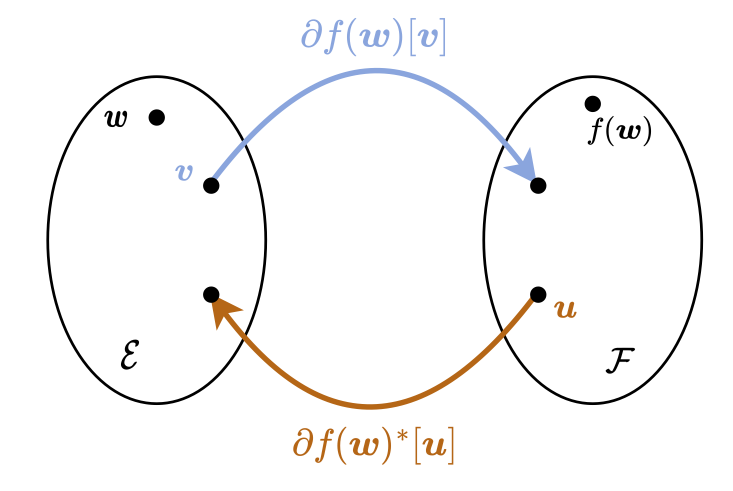]

.center[vector-Jacobian product (VJP) $\textcolor{chocolate}{\u \mapsto \partial f(\w)^*[\u]}$]

---

## Chain rule using linear maps

Consider $f:\cE \rightarrow \cF$ and $g:\cF \rightarrow \cG$, where $\cE$,
$\cF$ and $\cG$ are Euclidean spaces.

 

.center[
$
\partial (g\circ f)(\w)[\v] 
= \partial g(f(\w))[\partial f(\w)[\v]]
~ \forall \v \in \cE
$]

.center.width-80[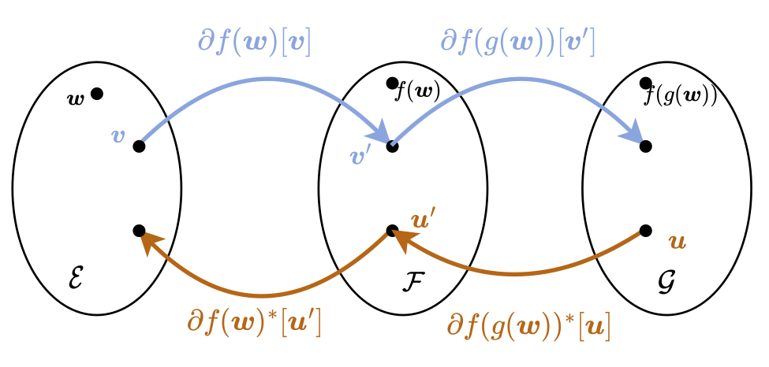]

.center[
$
\textcolor{chocolate}{\partial (g\circ f)(\w)^\*[\u] 
= \partial f(\w)^\*[\partial g(f(\w))^\*[\u]]
~ \forall \u \in \cG}
$]

 

These two formulas are the basis of forward-mode and reverse-mode autodiff!

---

## Second derivatives

The derivative $f'$ is itself a function so we may want to differentiate it.

The seecond derivative $f^{(2)}(w)$ of a differentiable function $f:
\RR \rightarrow \RR$ at $w \in \RR$ is defined as the derivative of $f'$ at
$w$
$$
f^{(2)}(w) \coloneqq f''(w)
\coloneqq \lim_{\delta \rightarrow 0} \frac{f'(w+\delta) - f'(w)}{\delta}
$$
provided that the limit exists

.center.width-60[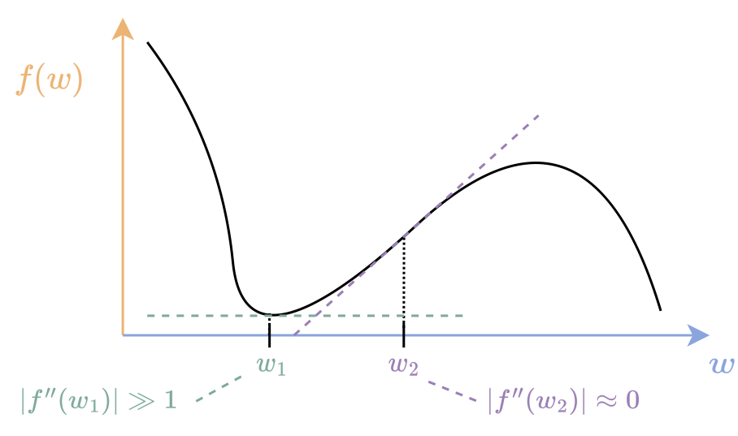]

---

## Second directional derivatives

The second directional derivative of $f:\RR^P \rightarrow \RR$ at
$\w\in \RR^P$ along $\v, \v' \in \RR^P$ is defined as the directional
derivative of $\w \mapsto \partial f(\w)[\v]$ along $\v'$,

 
$$
\partial^2 f(\w)[\v, \v'] 
\coloneqq \lim_{\delta \rightarrow 0} 
\frac{\partial f(\w + \delta \v')[\v] - \partial f(\w)[\v]}{\delta},
$$

 

provided that $\partial f(\w)[\v]$ is well-defined around $\w$ and that the
limit exists.

---

## Second partial derivatives

The second partial derivatives are defined

 

$$
\partial_{i j}^2 f(\w) \coloneqq \partial^2 f(\w)[\e\_i, \e\_j] 
$$

 

where $\e\_i$, $\e\_j$ the $i$-th and $j$-th canonical directions in $\RR^P$

---

## Hessians

The Hessian of a twice differentiable function $f:\RR^P \rightarrow
\RR$ at $\w$ is the $P \times P$ matrix gathering all second partial
derivatives,

 

$$
\nabla^2 f(\w) \coloneqq \begin{pmatrix}
  \partial\_{11} f(\w) & \ldots & \partial\_{1P} f(\w) \\\\
  \vdots & \ddots & \vdots \\\\
  \partial\_{P1} f(\w) & \ldots & \partial\_{PP} f(\w)
\end{pmatrix} \in \RR^{P \times P}
$$

 

Note that for all $\v, \v' \in \RR^P$,
$$
\partial^2 f(\w)[\v, \v'] = \langle \v, \nabla^2 f(\w) \v'\rangle
$$

---

## Hessian-vector products

Oftentimes, we don't need the whole Hessian but only need to multiply with it.

Consider the function $f \colon \cE \to \RR$.

Then for any $\w, \v \in \cE$, the linear map
$$
\v \mapsto \nabla^2 f(\w)[\v]
$$ 
is called the Hessian-vector product (HVP).

---

name: probaLearning

.center.smaller[**Part I: Fundamentals**]

- <a class="outline-link" href="#diff">Differentiation</a>
  * Continuous functions
  * Differentiable functions
  * Gradients
  * Jacobians
  * Linear maps: JVPs and VJPs
  * Hessians and Hessian-vector products (HVPs)
- **Probabilistic learning**
  * Supervised learning
  * Deterministic vs. probabilistic approaches
  * Learning a parameterized model
  * Binary classification, multiclass classification, regression, integer regression
  * Exponential family distribution

---

## Supervised learning

Predict $\y \in \cY$ from $\x \in \cX$

 

**Input space**

$\cX \subseteq \RR^D$

 

**Output space**

* Regression $\cY = \RR$
* Multivariate regression $\cY = \RR^M$
* Binary classification $\cY = \\{0,1\\}$
* Multiclass classification $\cY = [M] = \\{1, \dots, M\\}$
* Integer regression $\cY = \NN$
* Structured prediction $\cY = $ permutations, trees, sequences, ...

---

## Deterministic vs. probabilistic approaches

**Deterministic approach** 

Learn a mapping $\cX \to \cY$

 

**Probabilistic approach** 

Learn a mapping $f \coloneqq \cX \to \Lambda$
from input space $\cX$ to **distribution parameters** $\Lambda$
$$
\begin{aligned}
\lambdav &\coloneqq f(\x) \\\\
Y &\sim p\_\lambdav
\end{aligned}
$$

*Inference*

* Probability: $\PP(Y = \y | X = \x) = p\_\lambdav(\y) = p\_{f(\x)}(\y)$
* Expectation: $\EE(\phi(Y) | X = \x)$ for some mapping $\phi$
* Variance: $\VV(\phi(Y) | X = \x)$
* Mode: $\argmax\_{\y \in \cY} p\_\lambdav(\y) = \argmax\_{\y \in \cY} p\_{f(\x)}(\y)$

---

## Learning a parameterized model

**Deterministic approach** 

$$
L(\w) \coloneqq \frac{1}{N} \sum\_{i=1}^N \ell(f(\x\_i, \w), \y\_i)
\qquad f \colon \cX \times \cW \to \cY \quad \ell \colon \cY \times \cY \to \RR
$$

*Discontinuous* if $\cY$ is a discrete output space! (e.g., classification)

 

**Probabilistic approach**

$$
L(\w) \coloneqq \frac{1}{N} \sum\_{i=1}^N \ell(f(\x\_i, \w), \y\_i)
\qquad f \colon \cX \times \cW \to \Lambda \quad \ell \colon \Lambda \times \cY \to \RR
$$

*Continuous* and *differentiable* even if $\cY$ is a discrete output space!

 

Negative log-likelihood: $\ell(\lambdav, \y) \coloneqq -\log p\_\lambdav(\y)$

---

## Binary classification

 

$\cY = \\{0, 1\\}$

$Y \sim \mathrm{Bernoulli}(\pi)$ with parameter $\lambda \coloneqq \pi \in [0,1]$

$p_\pi(y) = \pi^y (1-\pi)^{1 -y}$

$\pi \coloneqq f(\x, \w) \coloneqq \mathrm{logistic}(g(\x, \w))
= \frac{1}{1 + \exp(-g(\x, \w))}$

$-\log p(y)$: binary logistic loss (a.k.a. binary cross-entropy loss)

 

.center.width-100[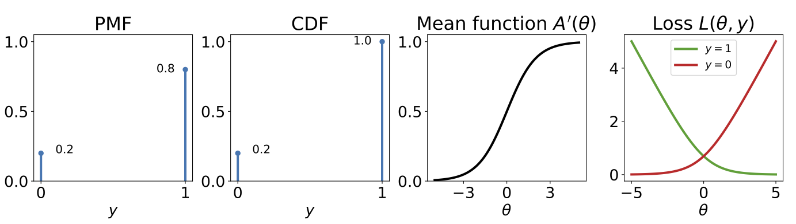]

---

## Multiclass classification

 

$\cY = [M] = \\{1, \dots, M\\}$

$Y \sim \mathrm{Categorical}(\piv)$ with parameter $\lambdav \coloneqq \piv \in \triangle^M$

$p_\pi(y) = \pi\_y$

$\piv \coloneqq f(\x, \w) \coloneqq \mathrm{softargmax}(g(\x, \w))$

$-\log p(y)$: multiclass logistic loss (a.k.a. cross-entropy loss)

 

.center.width-100[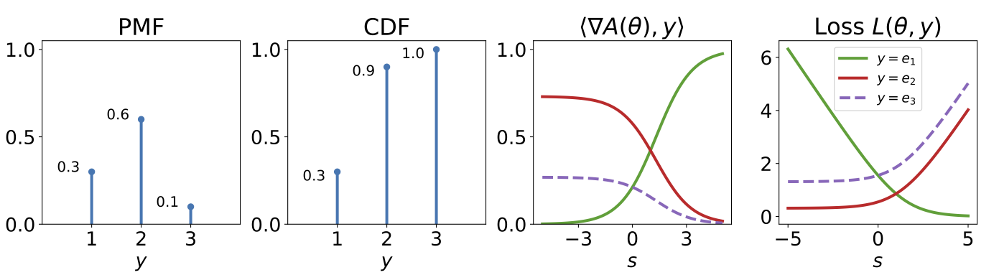]

---

## Regression

 

$\cY = \RR$

$Y \sim \mathrm{Normal}(\mu, \sigma)$ with parameters $\lambdav \coloneqq (\mu, \sigma) \in \RR \times \RR_+$

$p_{\mu,\sigma}(y) \coloneqq 
\frac{1}{\sigma \sqrt{2\pi} }
\exp\left(-\frac{1}{2}\frac{(y-\mu)^2}{\sigma^2}\right)$

$\mu \coloneqq f(\x, \w) \in \RR$ &nbsp;&nbsp;&nbsp;($\sigma$ is typically fixed to $1$)

$-\log p(y)$: squared loss up to constant

 

.center.width-100[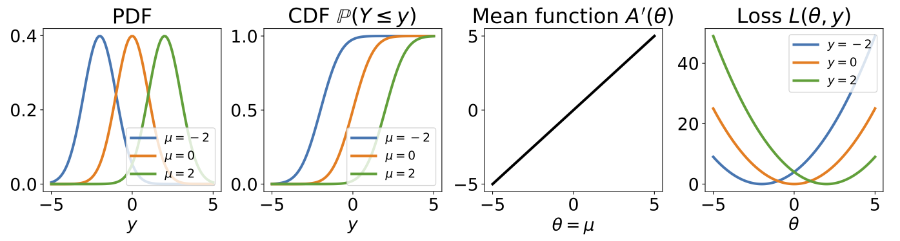]

---

## Integer regression

 

$\cY = \NN$

$Y \sim \mathrm{Poisson}(\lambda)$ with parameter $\lambda > 0$

$p_\lambda(y) \coloneqq \frac{\lambda^y \exp(-\lambda)}{y!}$

$\lambda \coloneqq f(\x, \w) \coloneqq \exp(g(\x, \w)) > 0$

$-\log p(y)$: Poisson loss 

 

.center.width-100[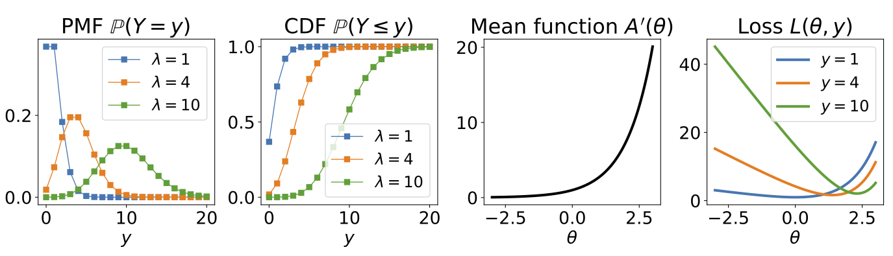]

---

## Exponential family distributions

Class of probability distributions whose PMF or PDF can be written as
$$
p\_\thetav(\y) 
= \frac{h(\y) \exp\left[\langle \thetav, \phi(\y) \rangle\right]}{\exp(A(\thetav))}
= h(\y) \exp\left[\langle \thetav, \phi(\y) \rangle - A(\thetav)\right]
$$
$\thetav$: natural parameters, $\phi$: sufficient statistic, $h$: base measure, $A$: log-partition

We can usually convert from original parameters $\lambdav$ to natural parameters $\thetav$.

**Example:** Bernoulli distribution with original parameter $\lambda = \pi$

$$
\begin{aligned}
p\_\lambda(y)
&\coloneqq \pi^y (1-\pi)^{1-y} \\\\
&= \exp(\log(\pi^y (1-\pi)^{1-y})) \\\\
&= \exp(y \log(\pi) + (1-y) \log(1-\pi)) \\\\
&= \exp(\log(\pi/(1-\pi)) y + \log(1 - \pi)) \\\\
&= \exp(\theta y - \log(1 + \exp(\theta))) \\\\
&= \exp(\theta y - \mathrm{softplus}(\theta)) \\\\
&\eqqcolon p\_\theta(y)
\end{aligned}
$$
where 
$\theta = \mathrm{logit}(\pi) \coloneqq \log(\pi/(1+\pi))
\iff
\pi = \mathrm{logistic}(\theta) = \frac{1}{1 + +\exp(-\theta)}
$.

---

class: middle

.center.width-80[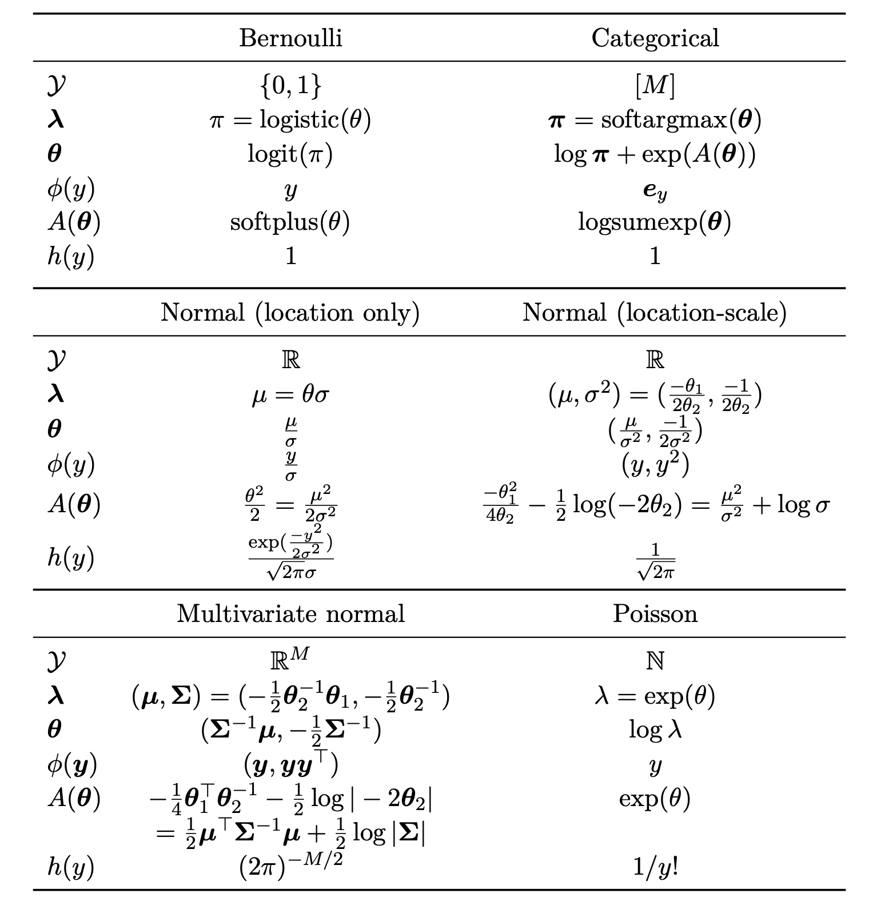]

---

## Log-partition function

$A$ is the logarithm of the distribution's normalization factor
$$
A(\thetav) 
\coloneqq
\log \sum_{\y \in \cY} h(\y) \exp\left[\langle \thetav, \phi(\y)
\rangle\right]
$$

 

$A(\thetav)$ is a convex function

 

The gradient $\nabla A(\thetav)$ is the expectation
$$
\muv(\thetav) 
\coloneqq \nabla A(\thetav)
= \EE\_{Y \sim p_\thetav}[\phi(Y)]
$$

---

## Negative log-likelihood of exponential family distribution

**Loss function**
$$
-\log p\_\thetav(\y)
= A(\thetav) - \langle \thetav, \phi(\y) \rangle - \log h(\y)
$$
A convex function w.r.t. $\thetav$

 

**Gradient**
$$
-\nabla\_\thetav \log p\_\thetav(\y)
= \nabla A(\thetav) - \phi(\y)
= \EE\_{Y \sim p_\thetav}[\phi(Y)] - \phi(\y)
$$
First moment matching!

 

**Objective function**
$$
L(\w) \coloneqq -\sum\_{i=1}^N \log p\_{\thetav\_i}(\y\_i)
$$
where $\thetav\_i \coloneqq f(\x\_i, \w)$

