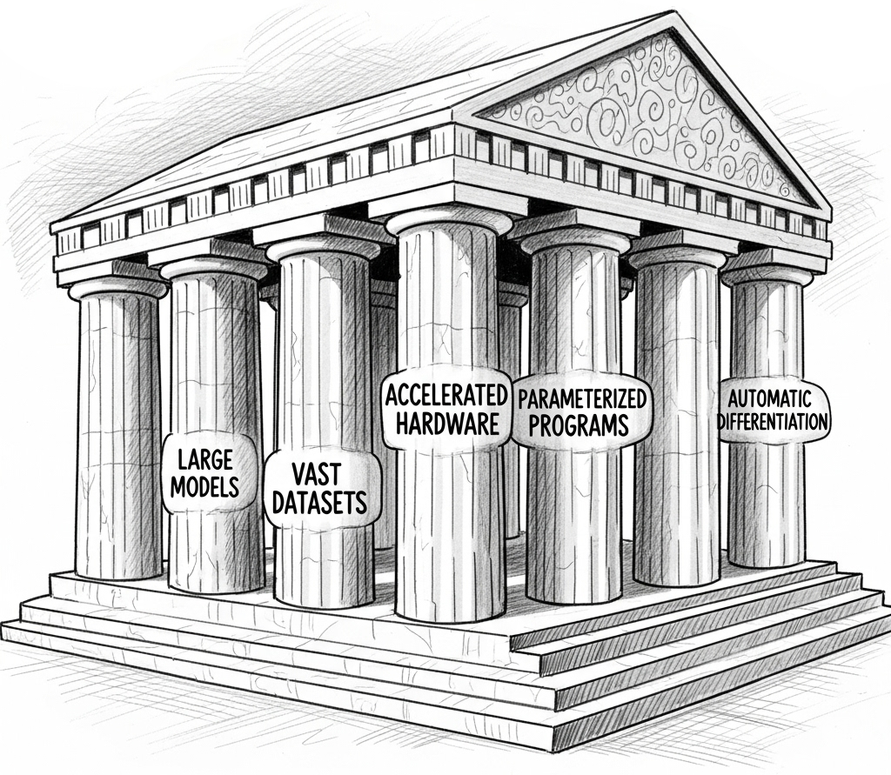

class: middle, center, title-slide

# The Elements of <br> Differentiable Programming

**Introduction**

<br><br>
Mathieu Blondel, Vincent Roulet

---

.center.width-80[]

---

class: middle

## Definition

.italic[
Differentiable programming is a programming paradigm in which complex computer
programs (including those with control flows and data structures) can be
differentiated end-to-end automatically, enabling gradient-based optimization of
parameters in the program.
]

---

## Neural nets as parameterized programs

- A program is defined as the composition of elementary operations.
- It forms a computation graph.
- It should define a mathematically valid function (a.k.a. pure function).
- It should have well-defined derivatives.

.center.width-100[]

---

## Why do we need derivatives?

- Derivative-free optimization is called **zero-order** optimization.

- It suffers from the **curse of dimensionality**:
it only scales to small dimensional problems, such as less than 10 dimensions.

- Derivative-based optimization is much more efficient and can scale to
millions or billions of parameters.

- Algorithms that use first and second derivatives are known as **first-order** and **second-order algorithms**, respectively

.center.width-70[]

---

## The autodiff revolution

```python
import jax.numpy as jnp
from jax import grad, jit

def predict(params, inputs): 
  for W, b in params:
    outputs = jnp.dot(inputs, W) + b
    inputs = jnp.tanh(outputs) 
  return outputs

def loss_fn(params, inputs, targets):
  outputs = predict(params, inputs)
  return jnp.sum((outputs - targets) ** 2)

grad_fun = jit(grad(loss_fn))
```

The user can focus on expressing the forward computation (model), enabling fast experimentation and alleviating the need for error-prone manual gradient derivation.

---

## The autodiff revolution

.grid[
.kol-1-2.left.width-100[
```python
from jax import grad
import jax.numpy as jnp

def tanh(x):
  y = jnp.exp(-2.0 * x)
  return (1.0 - y) / (1.0 + y)

fp = grad(tanh)
fpp = grad(grad(tanh))
...
```
]
.kol-1-2.center.width-100[

]
]

.center[Modern frameworks support higher-order derivatives.]

---

- Differentiable programming is not just deep learning.
  * Deep networks learn **intermediate features** and include **inductive biases**
(e.g., convolutional networks for image, Transformers for sequences).
  * Differentiable programming is useful beyond deep learning: reinforcement learning, probabilistic programming and scientific computing in general.

<br>

--

- Differentiable programming is not just autodiff.
  * How to design of principled differentiable operations?
  * How to make classical computer programming operations compatible with autodiff?

---

class: middle

## Book (<a href="https://arxiv.org/abs/2403.14606">arXiv</a>, <a href="https://github.com/diffprog/code">code</a>)

.center.width-60[]

<br>

.center[We will follow the book organization and notation.]

<br>

---

# Outline

- Introduction
- Part I: Fundamentals
  * Differentiation
  * Probabilistic learning
- Part II: Differentiable programs
  * Parameterized programs
  * Control flows
- Part III: Differentiating through programs
  * Finite differences
  * Automatic differentiation
  * Differentiating through optimization
  * Differentiating through integration
- Part IV: Smoothing programs
  * Smoothing by optimization
  * Smoothing by integration
