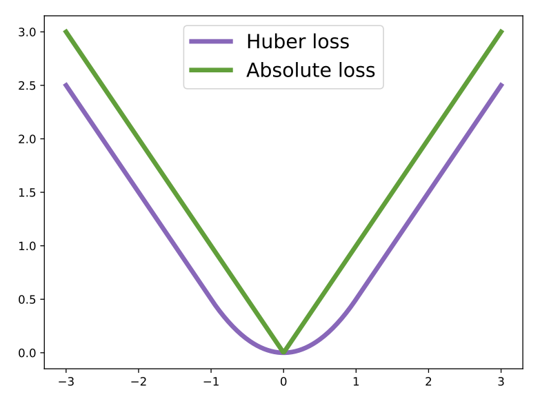
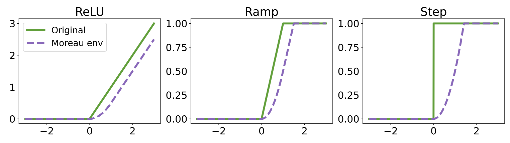
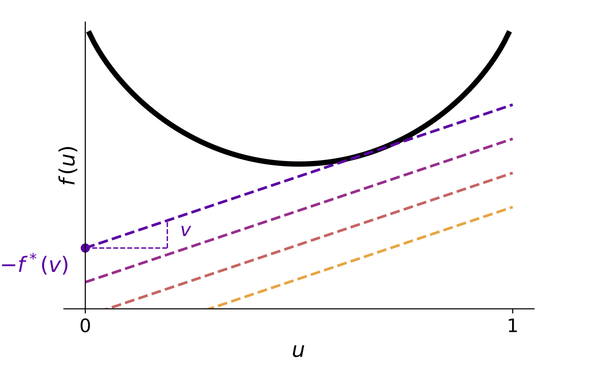
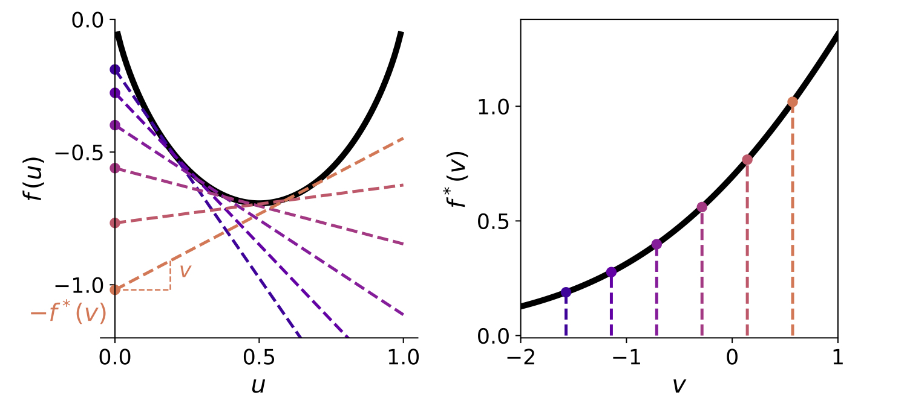
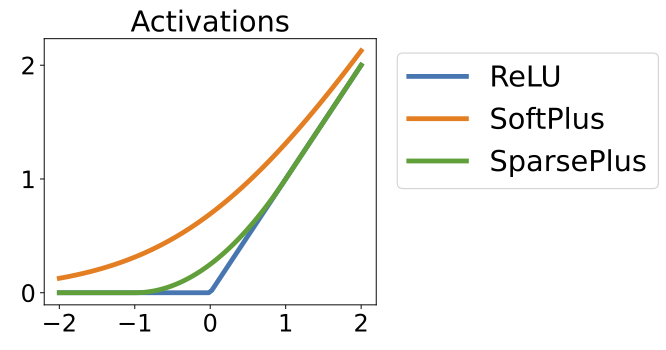
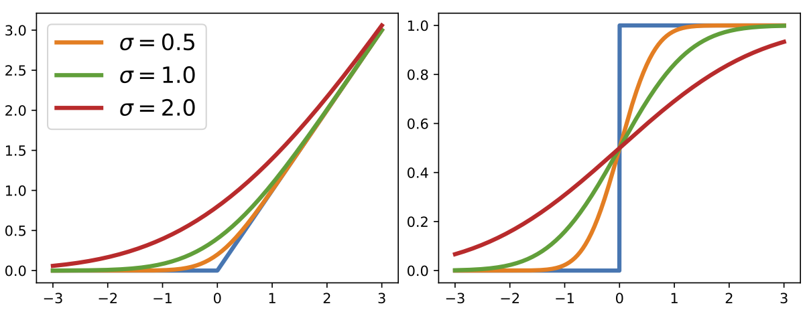
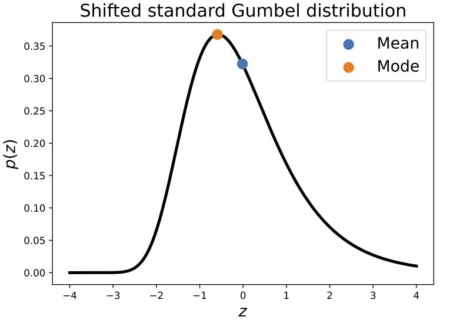

class: middle, center, title-slide

$$
\gdef\cF{\mathcal{F}}
\gdef\e{\bm{e}}
\gdef\u{\bm{u}}
\gdef\v{\bm{v}}
\gdef\y{\bm{y}}
\gdef\z{\bm{z}}
\gdef\muv{\bm{\mu}}
\gdef\RR{\mathbb{R}}
\gdef\EE{\mathbb{E}}
\gdef\zeros{\mathbf{0}}
$$

# The Elements of   Differentiable Programming

**Part IV: Smoothing programs**

  
Mathieu Blondel, Vincent Roulet

---

name: optim

.center.smaller[**Part IV: Smoothing programs**]

- **Smoothing by optimization**
  * Infimal convolution
  * Moreau envelope
  * Dual approach
- <a class="outline-link" href="#integration">Smoothing by integration</a>

---

## Infimal convolution

The infimal convolution between $f$ and $g$ is a new function $f \square g$

$$
(f \square g)(\muv) \coloneqq \inf\_{\u \in \RR^M} f(\u) + g(\muv - \u)
$$

 

--

**Link with classical convolution**

Counterpart of convolution where **integration** is replaced with **minimization**.

 

--

**Commutativity**

$$
(f \square g)(\muv) 
= \inf\_{\z \in \RR^M} f(\muv + \z) + g(\z)
= (g \square f)(\muv) \quad \forall \muv \in \RR^M
$$

The change of variable $\u \coloneqq \muv + \z$ is the **location-scale transform**.

--

**How to compute it?**

Analytically or numerically using an optimization algorithm

---

## Moreau envelope

The Moreau envelope of a function $f$ is a **smooth approximation** of it.

--

It is equal to the infimum colution of $f$ with $R(\z) \coloneqq \frac{1}{2} \\|\z\\|^2$

$$
\begin{aligned}
\mathrm{env}\_f(\muv) 
&\coloneqq (f \square R)(\muv) \\\\
&= \inf\_{\u \in \RR^M} f(\u) + R(\muv - \u) \\\\
&= \inf\_{\z \in \RR^M} f(\muv + \z) + R(\z) \\\\
&= \inf\_{\u, \z \in \RR^M} f(\u) + R(\z) \text{ s.t. } \u = \muv + \z.
\end{aligned}
$$

--

Compare with the proximal operator of $f$
$$
\mathrm{prox}\_{f}(\muv) 
\coloneqq \argmin\_{\u \in \RR^M} f(\u) + R(\muv - \u) 
$$

---

## Example: Huber loss

The Moreau envelope of $f(\u) \coloneqq \\|\u\\|\_1 = \sum\_{j=1}^M |u\_j|$ is the Huber loss
$$
\mathrm{env}\_f(\muv) = \sum\_{j=1}^M \mathrm{huber}(\mu\_j) \approx \sum_{j=1}^M |\mu\_j|
$$
where
$$
\mathrm{huber}(\mu\_j)
\coloneqq
\begin{cases}
\frac{\mu\_j^2}{2} &\text{ if } |\mu\_j| \le 1 \\\\
|\mu\_j| - \frac{1}{2} &\text{ if } |\mu\_j| > 1
\end{cases}
$$

.center.width-55[]

---

class: middle

.center.width-100[]

---

## Legendre-Fenchel transform (convex conjugate)

The Legendre-Fenchel transform of $f$ is another function denoted $f^\*$
$$
f^\*(\v) \coloneqq \sup\_{\u \in \mathrm{dom}(f)}
\langle \u, \v \rangle - f(\u)
$$

 

.center.width-80[]
$u \mapsto uv - f^\*(v)$
is the tighest affine lower bound of $f$ with a fixed slope $v$.

---

class: middle

.center.width-100[]

.center[Instead of representing a convex function $f$ by its graph $(\u, f(\u))$
we can represent it by the set of tangents with slope $\v$ and
intercept $-f^\*(\v)$.]

---

## Dual approach

If $f$ and $R$ are both convex and closed, we have
$$
f \square R = (f^\* + R^\*)^\*
$$
Go to the dual $f^\*$, add regularization $R^\*$ and come back to the primal.

The dual approach is often more convenient.

--

**Example: smoothed ReLU**

* $f(u) = \max(u, 0)$
* $f^\*(v) = \iota_{[0,1]}(v) = 0 \text{ if } v \in [0,1] \text{ else } \infty$
* $(f + R^\*)^\*(u) \approx f(u)$

.center.width-50[]

---

name: integration

.center.smaller[**Part IV: Smoothing programs**]

- <a class="outline-link" href="#optim">Smoothing by optimization</a>
- **Smoothing by integration**
  * Convolution
  * Dual approach
  * Perturbation of blackbox functions
  * Gumbel tricks

---

## Convolution

The convolution between two functions $f$ and $g$ is a new function $f \ast g$
$$
(f \ast g)(\mu) \coloneqq \int_{-\infty}^\infty f(u) g(\mu - u) du
$$
Can be seen as some **moving average**.

 

--

**Commutativity**

$$
(f \ast g)(\mu) 
= \int_{-\infty}^\infty f(\mu - z) g(z) dz
= (g \ast f)(\mu)
$$

 

--

This is again using the location-scale transform $u \coloneqq \mu + z$.

---

## Convolution with a kernel

The convolution $(f \ast \kappa\_\sigma)$ with a Gaussian kernel
$$
\kappa\_\sigma(z) 
\coloneqq \frac{1}{\sqrt{2\pi}\sigma} e^{-\frac{1}{2}(\frac{z}{\sigma})^2}
$$
is a **smooth approximation** of $f$

 

.center.width-80[]
.center[*Smoothed ReLU and smoothed binary step functions*]

---

## Two perspectives following from commutativity

The Gaussian with mean $\mu$ and standard deviation $\sigma$ has PDF
$$
p\_{\mu,\sigma}(u) 
\coloneqq \kappa\_\sigma(\mu - u)
= \frac{1}{\sqrt{2\pi}\sigma} e^{-\frac{1}{2} (\frac{\mu - u}{\sigma})^2}
$$

--

**Averaging perspective**

$$
\begin{aligned}
(f \ast \kappa\_\sigma)(\mu)
&\coloneqq 
\frac{1}{\sqrt{2\pi}\sigma}
\int\_{-\infty}^\infty f(u) e^{-\frac{1}{2} (\frac{\mu - u}{\sigma})^2} du \\\\
&= \EE\_{U \sim p\_{\mu,\sigma}}[f(U)]
\end{aligned}
$$
$U$ is a Gaussian distributed random variable centered around $\mu$.

--

**Perturbation perspective**

$$
\begin{aligned}
(f \ast \kappa\_\sigma)(\mu)
&\coloneqq \int\_{-\infty}^\infty f(\mu - z)
e^{-\frac{1}{2} (\frac{z}{\sigma})^2} dz \\\\
&= \EE\_{Z \sim p\_{0,\sigma}}[f(\mu - Z)] \\\\
&= \EE\_{Z \sim p\_{0,\sigma}}[f(\mu + Z)]
\end{aligned}
$$
$Z$ is Gaussian noise centered around $0$.

---

## Dual approach

**Fourier transform** of $f$ creates a new function $F$
$$
F(s) 
\coloneqq \cF\\{f\\}(s) 
\coloneqq \int\_{-\infty}^{\infty}f(t) e^{-i 2 \pi s t} dt
$$

 

--

**Convolution theorem**
$$
\cF\\{f \ast g\\} = \cF\\{f\\} \cdot \cF\\{g\\}
$$

 

--

**Gaussian smoothing**

$$
f \ast \kappa\_\sigma = \cF^{-1}\\{ \cF\\{f\\} \cdot \cF\\{\kappa\_\sigma\\}
\\}
$$

 

Go to Fourier domain, regularize and go back.

---

## Perturbation of blackbox functions

$$
\begin{aligned}
f\_\sigma(\muv)
&\coloneqq \EE\_{Z \sim p\_{\zeros,1}}[f(\muv + \sigma \cdot Z)] \\\\
&= \EE\_{U \sim p\_{\muv,\sigma}}[f(U)]
\end{aligned}
$$
Can be estimated by Monte-Carlo.

 

--

**Gradient estimation by pathwise gradient estimator**

$$
\nabla f\_\sigma(\muv) = 
\EE\_{Z \sim p_{\zeros,1}}[\nabla f(\muv + \sigma \cdot Z)]
$$
Assumes that $f$ is differentiable (almost everywhere).

 

--

**Gradient estimation by score function estimator**

$$
\nabla f\_\sigma(\muv) 
= \EE\_{U \sim p\_{\muv, \sigma}}[f(U) \nabla\_{\muv} \log p\_{\muv,\sigma}(U)]
$$
OK even if $f$ is blackbox but **high-variance** estimator.  
Adding variance reduction leads to so-called **evolution strategies** (see book).

---

## Gumbel distribution

Distribution frequently used in extreme value theory. 

**Standard Gumbel distribution**

$$
p(z) \coloneqq \exp(-\nu(z))
\quad \text{where} \quad
\nu(z) \coloneqq z + \gamma + \exp(-(z+\gamma))
$$
where $\gamma \approx 0.577$ is Euler's constant.

We use a **centered** definition, such that $\EE[Z] = 0$.

--

**Gumbel distribution with mean $\muv$ and scale $\sigma$**
$$
U \sim \mathrm{Gumbel}(\muv, \sigma) 
\iff 
U = \muv + \sigma Z, ~ Z\_i \sim \mathrm{Gumbel}(0, 1)
$$

.center.width-45[]

---

## Gumbel trick for categorical variables

$Z \sim \mathrm{Gumbel}(\zeros, 1) \in \RR^M$

 

--

**Perturbed argmax**

$$
i(\u) \coloneqq \argmax\_{i \in [M]} u\_i
$$

$$
Y \coloneqq i(\muv + \sigma \cdot Z)
\iff
Y \sim
\mathrm{Categorical}(\mathrm{softargmax}(\muv / \sigma))
$$

$$
\EE\_Y[\e\_Y] = \mathrm{softargmax}(\muv / \sigma)
$$

 

--

**Perturbed max**

$$
f(\u) \coloneqq \max\_{i \in [M]} u\_i 
$$

$$
V \coloneqq f(\muv + \sigma \cdot Z)
\iff
V \sim
\mathrm{Gumbel}(\sigma \mathrm{LSE}(\muv/\sigma), \sigma)
$$

$$
\EE\_V[V]
= \sigma \cdot \mathrm{LSE}(\muv / \sigma)
$$

---

## Gumbel softargmax (1/2)

Suppose we want to smooth out the **composition** 
$h(\u) \coloneqq g(\y(\u))$ between some function 
$g \colon \\{\e\_1, \dots, \e\_M\\} \to \RR$ and the argmax
$$
\y(\u) \coloneqq \argmax\_{\y \in \\{\e\_1, \dots, \e\_M\\}} \langle \y, \u \rangle
$$

 

--

We can do so by
$$
h\_\sigma(\muv) 
\coloneqq \EE\_Z \left[g(\y(\muv + \sigma Z))\right]
$$

 

--

How to compute the gradient $\nabla h\_\sigma(\muv)$? 

* We could use SFE but it has high variance.

* We cannot swap differentiation and integration (expectation).

---

## Gumbel softargmax (2/2)

**Key idea:** replace argmax with softargmax
$$
h\_{\sigma,\tau}(\muv) 
\coloneqq \EE\_Z \left[g(\mathrm{softargmax}\_\tau(\muv + \sigma Z))\right]
$$

 

--

**Pros**
* Low variance gradient estimator
* $\nabla h\_{\sigma,\tau}(\muv) \to h\_\sigma(\muv)$ as $\tau \to 0$

 

--

**Cons**
* Introduces an additional temperature parameter $\tau$
* $g$ needs to be well-defined on $\triangle^M$ instead of $\\{\e\_1, \dots, \e\_M\\}$
